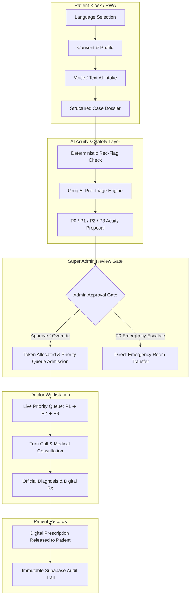

# MediKiosk — Production Technical Documentation

> **AI-Powered Patient Intake, Clinical Pre-Triage, and Hospital Queue Optimization MVP**

MediKiosk is an intelligent healthcare kiosk and clinical workflow platform designed to streamline outpatient department (OPD) intake, capture patient symptoms through multilingual voice/text conversational AI, evaluate operational urgency (P0–P3), enforce a Super Admin human-in-the-loop review gate, and deliver an organized priority turn queue to attending physicians.

---

## 🧭 Master Documentation Index

| Document | Purpose & Scope |
| :--- | :--- |
| [architecture.md](file:///docs/architecture.md) | High-level system architecture, component boundaries, and runtime layers. |
| [repository-map.md](file:///docs/repository-map.md) | Complete directory and file manifest explaining production code vs. scripts vs. config. |
| [frontend.md](file:///docs/frontend.md) | Next.js App Router, PWA design, component state, audio capture, and screen documentation. |
| [backend.md](file:///docs/backend.md) | FastAPI framework, dependency injection, router design, error handling, and resiliency fallbacks. |
| [api.md](file:///docs/api.md) | Complete OpenAPI/REST API specification (Auth, Patient, Intake, Triage Gate, Queue, Consultation). |
| [database.md](file:///docs/database.md) | PostgreSQL / Supabase schema, entity relationships (ERD), RLS security policies, and indexes. |
| [ai-pipeline.md](file:///docs/ai-pipeline.md) | Groq LLaMA prompt architecture, anti-hallucination guardrails, and question bank traversal. |
| [voice-pipeline.md](file:///docs/voice-pipeline.md) | Sarvam Saaras STT & Bulbul TTS integration, WebM streaming, audio validation, and latency handling. |
| [queue-engine.md](file:///docs/queue-engine.md) | P0/P1/P2/P3 acuity bands, Admin review gate, token allocation, and Doctor turn queue. |
| [business-rules.md](file:///docs/business-rules.md) | Strict medical boundaries, non-diagnostic invariants, deterministic red-flag overrides, and role limits. |
| [authentication-security.md](file:///docs/authentication-security.md) | Supabase Auth, Bearer token handling, dev mode bypass, Row Level Security, and HIPAA/data privacy. |
| [testing.md](file:///docs/testing.md) | Test suites, clinical workflow verification, anti-hallucination test suite, and execution guide. |
| [development-setup.md](file:///docs/development-setup.md) | Step-by-step local developer setup guide (Python venv, Node.js, Supabase, Groq, Sarvam). |
| [deployment.md](file:///docs/deployment.md) | Production build configuration, environment variables, hosting topology, and PWA setup. |
| [data-flows.md](file:///docs/data-flows.md) | 13 end-to-end data flow sequence diagrams across Patient, Admin, AI, and Doctor actors. |
| [state-machines.md](file:///docs/state-machines.md) | Lifecycle state machine diagrams (Session, Case, Triage Assessment, Queue Turn, Consultation). |
| [technical-debt.md](file:///docs/technical-debt.md) | Rigorous architectural debt audit, missing production pieces, and prioritized technical roadmap. |

---

## 🏥 Core Product Architecture at a Glance

---

## 🔒 Absolute System Invariants

1. **Non-Diagnostic AI Boundary:** The AI Engine (Groq LLaMA) **NEVER** issues medical diagnoses, prescriptions, drug dosages, or clinical certainties. It functions strictly as an intake structuring and triage advisory tool.
2. **Clinical Ownership:** Final diagnoses, clinical prescriptions, laboratory orders, and care plans are exclusively authored and signed by registered medical doctors.
3. **Super Admin Human-in-the-Loop Gate:** AI pre-triage assessments do not directly inject patients into the active Doctor queue. A Super Admin or Triage Nurse must review evidence, approve, or override priority before queue admittance.
4. **Emergency Bypass (P0):** True red flags (e.g. crushing chest pain with diaphoresis, acute stroke symptoms, severe anaphylaxis) trigger immediate deterministic emergency alerts and bypass standard OPD queues.
5. **Zero Invented Facts:** Unknown responses ("I don't know") are never defaulted to negative clinical answers ("No allergies"). Facts are extracted only from direct user statements.
