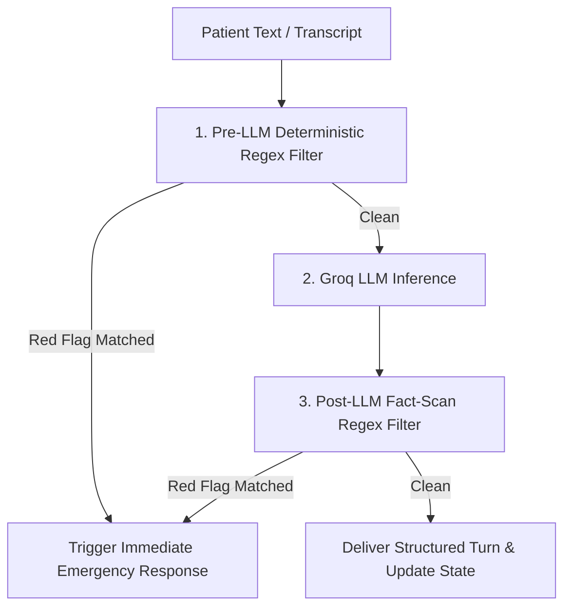

# AI Engine & Pre-Triage Pipeline

The MediKiosk AI pipeline coordinates two distinct artificial intelligence workflows:
1. **Conversational Intake Dialogue Engine** (`app/services/ai_engine.py`): Gathers and structures patient history turn-by-turn.
2. **AI Pre-Triage Acuity Engine** (`app/services/pre_triage.py`): Analyzes the finalized case to generate an advisory operational priority band (`P0`–`P3`), confidence rating, uncertainty gaps, and traceable evidence citations.

---

## 🤖 Model & Provider Configuration

- **Provider:** Groq Cloud API
- **Model:** `llama-3.3-70b-versatile` (configured via `GROQ_MODEL` environment variable)
- **Temperature:**
  - `0.2` for Conversational Intake (ensures high fidelity, structure compliance, and conversational warmth).
  - `0.1` for Pre-Triage Acuity Assessment (maximizes clinical determinism and repeatability).
- **Format Enforcement:** `response_format={"type": "json_object"}` on all Groq completions.

---

## 🛡️ Anti-Hallucination & Clinical Safety Rules

The AI Engine enforces rigorous clinical guardrails directly in the system prompt:

```markdown
## ABSOLUTE ETHICAL & CLINICAL RULES
1. NEVER diagnose any disease, illness, or condition.
2. NEVER prescribe medication, dosage, treatment, or home remedies.
3. NEVER claim clinical certainty.
4. Ask exactly ONE clear question at a time.
5. Do NOT repeat questions the patient already answered.
6. Match the patient's language and tone (English, Hindi, or Hinglish).
7. Preserve the patient's exact words and expressions.

## ANTI-HALLUCINATION & FACT-EXTRACTION GUARDRAILS
1. ZERO INVENTED FACTS: You must NEVER invent, assume, or hallucinate patient facts.
2. ONLY EXTRACT PROVEN FACTS: Extract facts ONLY if explicitly stated by the patient in the transcript.
3. UNKNOWN IS NOT "NO":
   - If the patient says "I don't know" -> value is "unknown".
   - If the patient does not mention medications -> value is "unknown / not reported", NOT "No medications".
   - If the patient does not mention allergies -> value is "unknown / not reported", NOT "No known allergies".
4. UNCERTAINTY IS NOT CONFIRMATION:
   - If the patient says "maybe fever" -> mark fever as "uncertain / suspected", NOT "confirmed".
5. DISTINGUISH STATUSES: Always distinguish between 'reported', 'denied', 'unknown', and 'uncertain'.
```

---

## 📋 Intake Question Bank & Routing (`QUESTION_BANK.json`)

The conversation pathway is guided by `docs/ai-intake/QUESTION_BANK.json`, containing:

### 1. Global Intake Progression
- `G1_CHIEF_COMPLAINT`: "What symptoms or health concerns brought you to the clinic today?"
- `G2_DURATION`: "How long have you been experiencing this?"
- `G3_SEVERITY`: "On a scale of 1 to 10, how severe is the discomfort right now?"
- `G4_MEDICATIONS`: "Are you currently taking any regular medications or recent medicines?"
- `G5_ALLERGIES`: "Do you have any known drug or food allergies?"

### 2. Supported Clinical Categories
1. **Fever / Infection (`fever`):** Temperature readings, chills, rigors, night sweats.
2. **Respiratory (`respiratory`):** Cough nature (dry vs. productive), shortness of breath, wheezing.
3. **Gastrointestinal (`gastrointestinal`):** Abdominal pain location, vomiting, diarrhea, food triggers.
4. **Headache / Neurological (`headache_neurological`):** Onset speed, photophobia, neck stiffness.
5. **Musculoskeletal (`musculoskeletal`):** Joint swelling, trauma history, weight-bearing ability.
6. **Skin & Allergy (`skin`):** Rash appearance, itching, rapid spreading.
7. **Urinary (`urinary`):** Burning (dysuria), frequency, flank pain.
8. **Chest Discomfort (`chest`):** Radiation to arm/jaw, exertional relationship, sweating.
9. **General Health (`general_health`):** Chronic checkup, fatigue, refill requests.

---

## 📊 Structured JSON Schemas

### 1. Conversational Turn Response Schema (`IntakeResponse`)
```json
{
  "ai_message": "Have you checked your temperature with a thermometer? If so, what was the reading?",
  "category": "fever",
  "extracted_facts": {
    "symptoms.fever.duration": "2 days"
  },
  "answered_fields": ["chief_complaint", "duration"],
  "missing_fields": ["temperature_reading", "associated_chills"],
  "next_question_id": "FEV_01",
  "red_flag": false,
  "survey_complete": false
}
```

### 2. Pre-Triage Assessment Schema (`PreTriageAssessment`)
```json
{
  "assessment_id": "triage_4e88a6adb82b",
  "intake_id": "demo-sess-001",
  "patient_id": "patient-rajesh",
  "priority": "P0",
  "confidence_band": "high",
  "confidence_score": 0.99,
  "uncertainty": {
    "needs_human_review": true,
    "reasons": ["Crushing chest pain radiating to left jaw with profuse sweating."],
    "missing_information": ["Vital signs (Blood pressure, Pulse, SpO2)"],
    "contradictions": []
  },
  "safety_flags": ["chest_pain_radiating", "diaphoresis"],
  "evidence": [
    {
      "source": "patient_intake",
      "field": "chief_complaint",
      "summary": "Crushing substernal chest pain radiating to left jaw"
    }
  ],
  "recommended_next_action": "immediate_er_escalation",
  "generated_at": "2026-09-09T10:00:00Z",
  "status": "awaiting_review"
}
```

---

## 🛑 Dual Safety Validation Layer



1. **Pre-LLM Regex Scan:** Scans raw patient input against compiled regular expressions for 7 critical emergencies before sending to Groq.
2. **Post-LLM Fact Scan:** Scans the LLM's extracted JSON facts to ensure the model did not uncover or synthesize an emergency symptom during translation.
3. **Emergency Escalation:** If either filter matches, the session status immediately shifts to `red_flagged`, sets `survey_complete = true`, and issues emergency directives.
