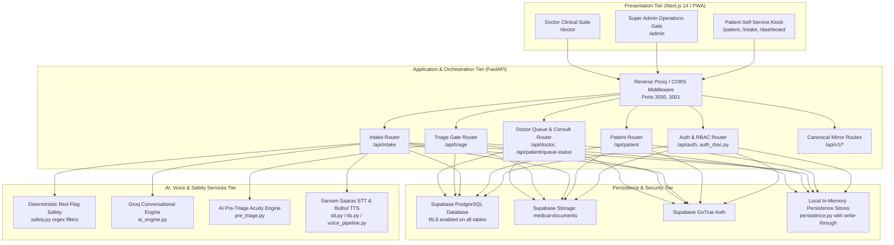
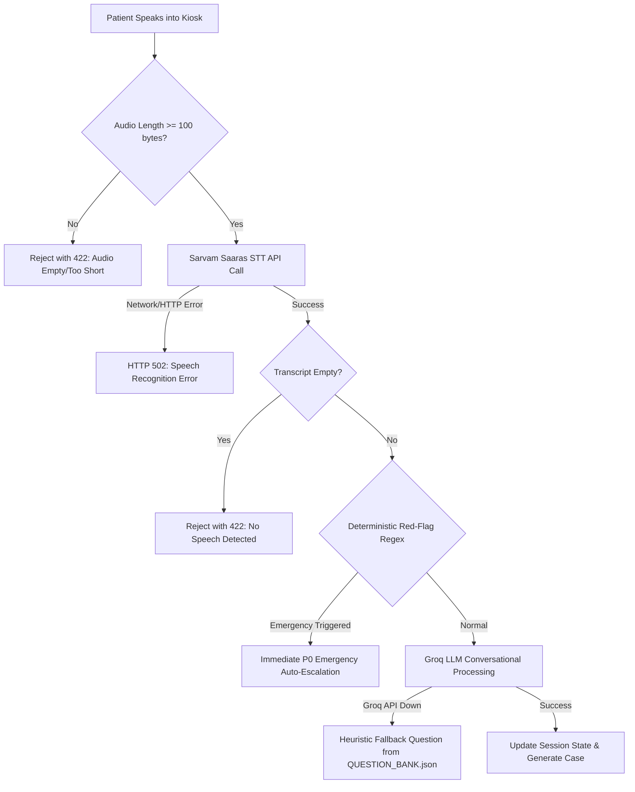

# System Architecture

## 1. High-Level Architecture

MediKiosk is built on a decoupled, service-oriented architecture with strict separation of concerns across presentation, business orchestration, artificial intelligence, and persistence tiers.

---

## 2. Layer-by-Layer Architecture

### 2.1 Presentation Tier (Frontend)
- **Framework:** Next.js 14 (App Router) with TypeScript, React 18, and Sass/SCSS modules.
- **Port:** Runs locally on `http://localhost:3000` (development fallback supports `3001`).
- **Key Portals & Pages:**
  - `src/app/page.tsx`: Central entry gateway directing users to Patient Kiosk, Doctor Suite, or Super Admin Dashboard.
  - `src/app/patient/page.tsx`: Self-service patient intake kiosk with multi-step progression: language selection (`en`, `hi`, `mr`, `ta`, `bn`), consent boundary, identity/OTP verification, voice/text intake with real-time audio waveform/recorder, red-flag emergency detection, AI pre-triage outcome screens (P0 emergency alert / P1–P3 token display), and live queue dashboard with printable digital prescription.
  - `src/app/doctor/page.tsx`: Attending physician clinical suite with prioritized turn queue (P1 > P2 > P3 FIFO), P0 emergency handover banner, patient dossier review, examination notes, vitals recording, official diagnosis, digital Rx authoring, and turn calling.
  - `src/app/admin/page.tsx`: Super Admin Operations & Triage Review Gate with real-time KPIs, persistent P0 Emergency Lane, review queue for pending intakes, priority override modal with mandatory clinical rationale, department doctor availability, hospital load analytics, and immutable audit log.
  - `src/app/intake/[sessionId]/page.tsx`: Standalone session-based conversational intake interface.
  - `src/app/dashboard/page.tsx`: Standalone patient token tracker and live queue monitor.
  - `src/lib/api.ts`: Typed API client handling bearer authentication, FormData file uploads, and Next.js proxy rewrites.
  - `src/components/shared.tsx`: Reusable design system components (`MKLogo`, `PriorityBadge`, `StatusChip`, `AITriageContext`, `EvidenceDrawer`, `WhyAllocation`, `CaseTimeline`, `ConfirmDialog`, `ReasonInput`, `ToastContainer`).

### 2.2 Application & Business Tier (Backend)
- **Framework:** FastAPI (`app/main.py`) running on Python 3.10+ / Uvicorn at `http://127.0.0.1:8000`.
- **CORS Configuration:** Explicitly allows `http://localhost:3000`, `http://127.0.0.1:3000`, `http://localhost:3001`, and `http://127.0.0.1:3001`.
- **RBAC & Auth Enforcement (`app/auth_rbac.py`):** Centralized role verification (`patient`, `doctor`, `admin`), safe walk-up kiosk token handling (`kiosk` tokens mapped to patient role), and public endpoint fallback with optional headers.
- **Persistence Architecture (`app/persistence.py`):** Hybrid persistence layer managing in-memory stores (`_TRIAGE_STORE`, `_QUEUE_STORE`, `_CONSULTATION_STORE`, `_EMERGENCY_STORE`, `_SESSIONS_STORE`) with resilient write-through to Supabase PostgreSQL.
- **Core Domain Routers:**
  - `app/routers/auth.py`: Registration, password login with role resolution, current user `/api/auth/me`.
  - `app/routers/patient.py`: Profile management, consent recording, medical document upload to Supabase Storage, and session listing.
  - `app/routers/intake.py`: Conversational turns, voice transcription, red-flag screening, structured case synthesis, and immediate P0 auto-escalation.
  - `app/routers/triage.py`: Super Admin review gate (`/api/triage/pending`, `/api/triage/{id}/review`), deterministic demo seeder (`/api/triage/seed-demo`), priority override validation, and emergency coordination.
  - `app/routers/queue.py`: Doctor priority turn queue, turn state transitions (`queued -> called -> in_consultation -> completed`), consultation record release, and live patient queue status polling.
  - **Canonical `/api/v1` Mirror:** Automatic route registration mirroring all endpoints under `/api/v1/*`.

### 2.3 AI, Voice & Safety Services Tier
- **Deterministic Red-Flag Layer (`app/services/safety.py`):**
  - Executes **before** and **after** LLM inference.
  - Regex pattern-matches 7 acute medical emergency categories in English and Hindi (acute myocardial infarction, severe respiratory distress, acute stroke/neurology, anaphylaxis, severe hemorrhage, loss of consciousness, self-harm intent).
  - Triggers immediate P0 emergency workflow without waiting for LLM or human review.
- **AI Conversational Engine (`app/services/ai_engine.py`):**
  - Powered by **Groq** (`llama-3.3-70b-versatile` or `openai/gpt-oss-20b`).
  - Employs `docs/ai-intake/QUESTION_BANK.json` for category-specific symptom exploration.
  - Enforces strict anti-hallucination rules (extracts only stated facts; never invents unmentioned symptoms, durations, or allergies).
- **AI Pre-Triage Acuity Engine (`app/services/pre_triage.py`):**
  - Analyzes completed `PatientCase` to propose advisory priority bands (`P0`, `P1`, `P2`, `P3`), confidence score, uncertainty gaps, and traceable evidence citations.
  - Strictly non-diagnostic: excluded from suggesting diagnoses, differential diagnoses, or disease probabilities.
- **Voice & Speech Integration (`app/services/stt.py` & `app/services/tts.py`):**
  - **STT:** Sarvam AI Saaras v3 (`https://api.sarvam.ai/speech-to-text`) supporting Indian languages (`hi-IN`, `en-IN`, etc.).
  - **TTS:** Sarvam AI Bulbul v3 (`https://api.sarvam.ai/text-to-speech`) producing natural Indian-accented speech.

### 2.4 Persistence & Security Tier
- **Database:** Supabase PostgreSQL with 10 production tables and Row-Level Security (RLS) policies.
- **Storage:** Supabase Storage bucket (`medical-documents`) for patient-uploaded medical reports.
- **Audit Logging:** Dedicated `audit_logs` table tracking consent, case generation, triage approval/overrides, and consultation events.
- **Resilient Fallback Mode:** In-memory stores (`app/persistence.py`) ensure full platform functionality during local network disconnects or Supabase downtime.

---

## 3. Subsystem Breakdown & Runtime Interaction

| Subsystem | Primary Files | Inputs | Outputs | External Dependencies |
| :--- | :--- | :--- | :--- | :--- |
| **Authentication & RBAC** | `app/auth_rbac.py` `app/routers/auth.py` `src/app/login/page.tsx` | Email, password, bearer token | `AuthUser` (role, user_id), JWT token | Supabase GoTrue Auth |
| **Intake Engine** | `app/routers/intake.py` `app/services/ai_engine.py` | Patient text or audio WebM | Structured `IntakeResponse`, `PatientCase` | Groq API, Sarvam AI |
| **Safety Engine** | `app/services/safety.py` | Raw user text, extracted facts | `RedFlagResult` (boolean + signal IDs) | None (Pure regex) |
| **Voice Pipeline** | `app/services/stt.py` `app/services/tts.py` `app/services/voice_pipeline.py` | Microphone audio blob (WebM/WAV) | Text transcript, base64 synthesized WAV | Sarvam AI REST APIs |
| **Triage Review Gate** | `app/routers/triage.py` `src/app/admin/page.tsx` | `PatientCase`, Admin action (`approve`/`override`) | `PreTriageAssessment`, Queued Token | Groq API, Supabase |
| **Doctor Queue & Consult** | `app/routers/queue.py` `src/app/doctor/page.tsx` | Doctor turn transitions, `ConsultationRequest` | Active turn order, `ConsultationRecord` | Supabase DB |
| **Patient Queue Status** | `app/routers/queue.py` `src/app/patient/page.tsx` `src/app/dashboard/page.tsx` | Session ID or Patient ID | Live token, queue position, estimated wait, Digital Rx | Backend Queue API |

---

## 4. Key Failure Modes & Defensive Strategies

1. **Microphone Mute / Silent Audio:** If audio is under 100 bytes or transcription yields empty text, the system rejects it with HTTP 422 without fabricating fake patient data.
2. **Groq LLM Unavailability:** If Groq encounters rate-limiting or network issues, `_fallback_response()` safely selects the next unanswered field from `QUESTION_BANK.json` without crashing the interview.
3. **Supabase Connectivity Loss:** All routers use `app/persistence.py` with in-memory stores (`_TRIAGE_STORE`, `_QUEUE_STORE`, `_CONSULTATION_STORE`, `_EMERGENCY_STORE`), enabling uninterrupted local demo execution.
4. **P0 Invariant Defense:** Calling `POST /api/triage/{id}/review` with `action="approve"` on a P0 case is programmatically blocked with HTTP 400. `persistence.py` throws a hard `ValueError` if any code attempts to insert P0 into `_QUEUE_STORE`.
