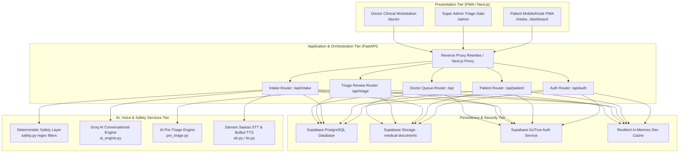
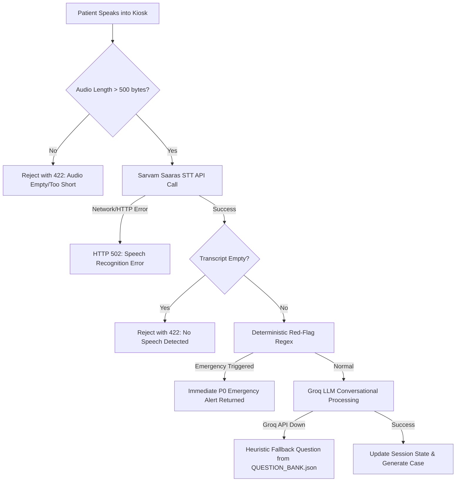

# System Architecture

## 1. High-Level Architecture

MediKiosk is built on a decoupled, service-oriented architecture with strict separation of concerns across presentation, business orchestration, artificial intelligence, and persistence tiers.

---

## 2. Layer-by-Layer Architecture

### 2.1 Presentation Tier (Frontend)
- **Framework:** Next.js 14 (App Router) with TypeScript, React 18, and Sass/SCSS modules.
- **Port:** Runs locally on `http://localhost:3000`.
- **Key Modules:**
  - `src/app/page.tsx`: Multilingual entry gate and language selector (`en`, `hi`, `hinglish`).
  - `src/app/consent/page.tsx`: Medical consent boundary.
  - `src/app/intake/[sessionId]/page.tsx`: Real-time voice/text conversational intake interface.
  - `src/app/admin/page.tsx`: Super Admin Clinical Triage Gate with P0–P3 review, evidence inspection, priority override, and emergency escalation.
  - `src/app/doctor/page.tsx`: OPD priority queue (`P1 -> P2 -> P3`), turn call management, and digital prescription issuance.
  - `src/app/dashboard/page.tsx`: Live patient token queue tracker, timeline progress stepper, and digital prescription viewer.
  - `src/lib/api.ts`: Typed API client handling bearer authentication, FormData file uploads, and Next.js proxy rewrites.

### 2.2 Application & Business Tier (Backend)
- **Framework:** FastAPI (`app/main.py`) running on Python 3.10+ / Uvicorn at `http://localhost:8000`.
- **CORS Configuration:** Explicitly allows `http://localhost:3000` and `http://127.0.0.1:3000`.
- **Core Domain Routers:**
  - `app/routers/auth.py`: Registration, password login, current user verification, and token extraction.
  - `app/routers/patient.py`: Profile updates, consent logging, document upload to Supabase Storage, and session history.
  - `app/routers/intake.py`: Conversational turns, voice transcription orchestration, red-flag screening, and structured case synthesis.
  - `app/routers/triage.py`: Super Admin approval gate, demo seeding (10 clinical profiles), priority override, and token assignment.
  - `app/routers/queue.py`: Doctor priority queue management, turn state transitions (`queued -> called -> in_consultation -> completed`), and consultation record persistence.

### 2.3 AI, Voice & Safety Services Tier
- **Deterministic Red-Flag Layer (`app/services/safety.py`):**
  - Executes **before** and **after** LLM inference.
  - Pattern-matches acute medical emergencies: acute chest pain/infarction, severe respiratory distress, stroke/focal neurology, anaphylaxis, severe hemorrhage, loss of consciousness, and self-harm intent.
- **AI Conversational Engine (`app/services/ai_engine.py`):**
  - Powered by **Groq** (`llama-3.3-70b-versatile` or `openai/gpt-oss-20b`).
  - Uses `docs/ai-intake/QUESTION_BANK.json` for category-specific follow-ups.
  - Enforces strict anti-hallucination rules (zero invented symptoms/allergies/medications).
- **AI Pre-Triage Acuity Engine (`app/services/pre_triage.py`):**
  - Analyzes completed `PatientCase` objects to propose advisory priority bands (`P0`, `P1`, `P2`, `P3`), confidence rating, uncertainty gaps, and traceable evidence citations.
- **Voice & Speech Integration (`app/services/stt.py` & `app/services/tts.py`):**
  - **STT:** Sarvam AI Saaras v3 (`https://api.sarvam.ai/speech-to-text`) with multilingual Indian language support.
  - **TTS:** Sarvam AI Bulbul v3 (`https://api.sarvam.ai/text-to-speech`) producing high-fidelity Indian-accented speech.

### 2.4 Persistence & Security Tier
- **Database:** Supabase PostgreSQL with full Row-Level Security (RLS) policies.
- **Storage:** Supabase Storage bucket (`medical-documents`) for patient-uploaded medical reports.
- **Audit Logging:** Dedicated `audit_logs` table tracking consent, case generation, triage approval/overrides, and consultation events.
- **Resilient Fallback Mode:** In-memory fallback dictionaries (`_MEM_SESSIONS`, `_TRIAGE_ASSESSMENTS`, `_DOCTOR_QUEUE`, `_DEV_PROFILES`) ensure the full application functions even during local network disconnects or Supabase downtime.

---

## 3. Subsystem Breakdown & Runtime Interaction

| Subsystem | Primary Files | Inputs | Outputs | External Dependencies |
| :--- | :--- | :--- | :--- | :--- |
| **Authentication** | `app/routers/auth.py` `src/app/login/page.tsx` | Email, password, bearer token | JWT token, user identity | Supabase Auth (GoTrue) |
| **Intake Engine** | `app/routers/intake.py` `app/services/ai_engine.py` | Patient text or audio WebM | Structured `IntakeResponse`, `PatientCase` | Groq API, Sarvam AI |
| **Safety Engine** | `app/services/safety.py` | Raw user text, extracted facts | `RedFlagResult` (boolean + signal IDs) | None (Pure regex) |
| **Voice Pipeline** | `app/services/stt.py` `app/services/tts.py` | Microphone audio blob (WebM/WAV) | Text transcript, base64 synthesized WAV | Sarvam AI REST APIs |
| **Triage Review Gate** | `app/routers/triage.py` `src/app/admin/page.tsx` | `PatientCase`, Admin action (`approve`/`override`) | `PreTriageAssessment`, Queued Token | Groq API, Supabase |
| **Doctor Queue** | `app/routers/queue.py` `src/app/doctor/page.tsx` | Doctor call/start/consult actions | Active turn order, `ConsultationRecord` | Supabase DB |
| **Patient Tracker** | `src/app/dashboard/page.tsx` | Session ID / User ID | Live queue position, estimated wait, Digital Rx | Backend Queue API |

---

## 4. Key Failure Modes & Defensive Strategies

1. **Microphone Mute / Silent Audio:** If audio is under 100 bytes or transcription yields empty text, the system rejects it with HTTP 422 without fabricating fake patient data.
2. **Groq LLM Unavailability:** If Groq encounters rate-limiting or network issues, `_fallback_response()` safely selects the next unanswered field from `QUESTION_BANK.json` without crashing the interview.
3. **Supabase Connectivity Loss:** All routers include try/catch fallbacks to in-memory dictionaries (`_MEM_SESSIONS`, `_TRIAGE_ASSESSMENTS`, `_DOCTOR_QUEUE`), enabling uninterrupted local demo execution.
