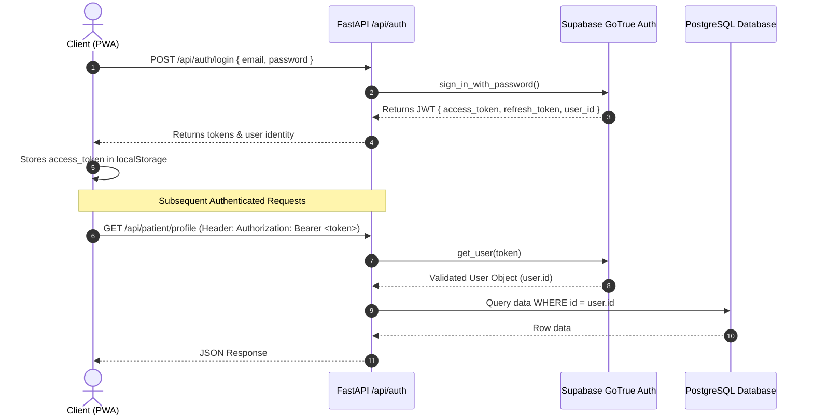

# Authentication, Authorization & Security Audit

This document details the security posture, authentication architecture, token handling, Row Level Security (RLS) data isolation, and privacy considerations in MediKiosk.

---

## 🔐 Authentication Architecture

MediKiosk leverages **Supabase Auth (GoTrue)** for secure identity management, password hashing (bcrypt), and JSON Web Token (JWT) issuance.

---

## 🎫 Token Handling & Role Verification (`app/routers/auth.py`)

- **Bearer Token Extraction:** All protected endpoints extract the user token via FastAPI's `Header(...)` parameter.
- **`get_user_id(authorization: str) -> str` Helper:**
  - Extracts the raw JWT from `Bearer <token>`.
  - Calls `supabase.auth.get_user(token)` to ensure the token signature and expiration are valid.
  - **Dev Mode Fallback:** Recognizes development and test tokens (`dev_test_token_medikiosk`, `mock-admin-token`, `mock-doctor-token`, `patient-101`, `usr_*`) to allow automated test execution and offline demonstrations without requiring live network calls to Supabase.

---

## 🛡️ Row Level Security (RLS) Policies

All PostgreSQL tables have Row Level Security enabled in `supabase/migration.sql`:

1. **`patients`:**
   - `SELECT USING (id = auth.uid())`
   - `UPDATE USING (id = auth.uid())`
   - `INSERT WITH CHECK (id = auth.uid())`
2. **`patient_sessions`:**
   - `SELECT USING (patient_id = auth.uid())`
   - `INSERT WITH CHECK (patient_id = auth.uid())`
3. **`conversation_messages`:**
   - `SELECT USING (session_id IN (SELECT id FROM patient_sessions WHERE patient_id = auth.uid()))`
4. **`patient_cases`:**
   - `SELECT USING (patient_id = auth.uid())`
5. **`medical_documents`:**
   - `SELECT USING (patient_id = auth.uid())`
6. **`audit_logs`:**
   - No public/authenticated RLS policies; accessible exclusively via Supabase Service-Role key held securely by the backend service.

---

## 🔒 Security Audit Findings & Risk Analysis

| Category | Finding | Current Implementation | Production Recommendation |
| :--- | :--- | :--- | :--- |
| **Secrets in Client** | No API keys exposed in frontend bundle. | `NEXT_PUBLIC_SUPABASE_PUBLISHABLE_KEY` only. Groq & Sarvam keys are kept strictly in backend `.env`. | Maintain strict server-side secret boundaries. |
| **Token Storage** | Tokens stored in browser `localStorage`. | Standard for PWA MVP. | Transition to `HttpOnly`, `SameSite=Strict` secure cookies in production to eliminate XSS token theft vectors. |
| **Role-Based Access Control (RBAC)** | Admin & Doctor portals currently verify token presence. | Role is inferred from token prefix in dev mode. | Add formal Supabase Custom Claims / user metadata roles (`app_metadata: { role: 'doctor' | 'admin' | 'patient' }`) in production. |
| **File Upload Validation** | File size validated on frontend (10MB) and backend. | MIME type checked during multipart upload. | Implement antivirus / malware scanning pipeline (e.g. ClamAV) on Supabase Storage upload hooks. |
| **CORS Policy** | Restricted in `app/main.py`. | Explicitly allows `http://localhost:3000` and `http://127.0.0.1:3000`. | Update allowed origins in production to the hospital's verified domain / kiosk subnet. |
| **Health Data Privacy (HIPAA/DISHA)** | Audio transcripts & patient cases contain Protected Health Information (PHI). | Data stored in encrypted PostgreSQL with RLS. | Enable full column-level encryption (pgcrypto) for sensitive clinical narrative fields and enforce automated data retention/purging policies. |
