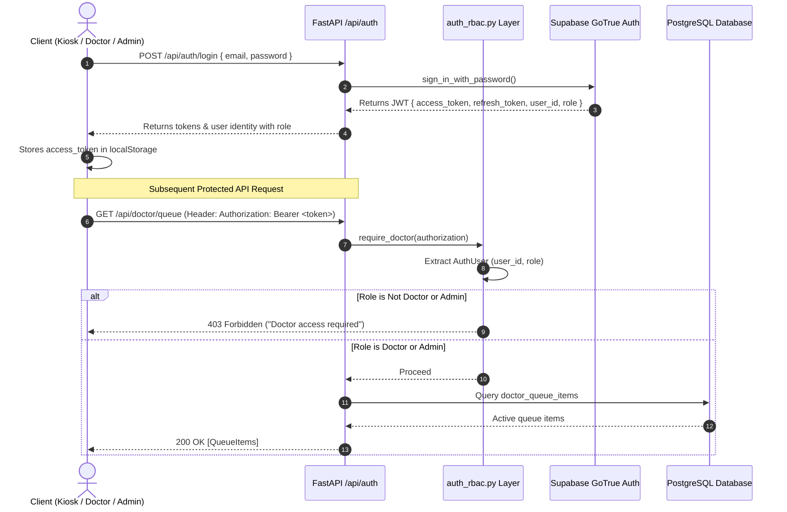

# Authentication, Authorization & Security Architecture

This document details the security posture, authentication architecture, Role-Based Access Control (RBAC), walk-up kiosk identity management, Row Level Security (RLS) data isolation, and privacy considerations in MediKiosk.

---

## 🔐 Authentication Architecture

MediKiosk leverages **Supabase Auth (GoTrue)** for secure identity management, password hashing (bcrypt), and JSON Web Token (JWT) issuance, supplemented by a centralized backend RBAC security layer in `app/auth_rbac.py`.

---

## 👥 Role-Based Access Control (`app/auth_rbac.py`)

Access control is centrally governed by `app/auth_rbac.py`:

| Role | Permitted Actions | Restricted Endpoints |
| :--- | :--- | :--- |
| **`patient`** | Initiate intake, send messages/voice, view personal queue status, download personal digital Rx. | Blocked from `/api/triage/*`, `/api/doctor/*`. Blocked from other patients' sessions. |
| **`doctor`** | View priority OPD queue, call patient turns, conduct consultations, author official diagnoses and digital prescriptions. | Blocked from `/api/triage/*` admin review actions. |
| **`admin`** | Super Admin operations: review pending pre-triage assessments, approve/override priorities, coordinate P0 emergencies, seed test cases, inspect audit logs. | Full administrative access. |

### Route Guards:
- `require_admin(authorization: str | None) -> AuthUser`: Raises `HTTP 401` if unauthenticated, `HTTP 403 Forbidden` if role is not `admin`.
- `require_doctor(authorization: str | None) -> AuthUser`: Raises `HTTP 401` if unauthenticated, `HTTP 403 Forbidden` if role is not `doctor` or `admin`.
- `require_patient(authorization: str | None) -> AuthUser`: Ensures valid authenticated session.
- `assert_patient_access(user: AuthUser, patient_id: str)`: Enforces patient data isolation. If a patient attempts to view or complete another patient's session, raises `HTTP 403 Forbidden`.

---

## 🖥️ Safe Kiosk Walk-Up Authentication

To accommodate walk-up physical kiosks and public queue display screens without weakening overall security:
1. **Public Polling Support:**
   - `GET /api/patient/queue-status` accepts an optional `session_id` query parameter and an optional `Authorization: str | None = Header(None)`.
   - Anonymous walk-up kiosks can display real-time wait times and token numbers for their active session without requiring pre-registered JWT credentials.
2. **Kiosk Bearer Token Scoping:**
   - Tokens containing `kiosk` (e.g. `Bearer kiosk-terminal-101`) are automatically mapped to role `patient` with a scoped user ID (`kiosk-terminal-101`).
   - Kiosk tokens are granted patient intake privileges but are strictly rejected with `HTTP 403 Forbidden` if used against doctor or admin routes.

---

## 🛡️ Row Level Security (RLS) Policies

All 10 PostgreSQL tables have Row Level Security enabled in `supabase/migration.sql`:

1. **`patients`:**
   - `SELECT USING (id = auth.uid())`
   - `UPDATE USING (id = auth.uid())`
   - `INSERT WITH CHECK (id = auth.uid())`
2. **`patient_sessions` & `patient_cases`:**
   - Restricted to session owner (`patient_id = auth.uid()`).
3. **`conversation_messages`:**
   - `SELECT USING (session_id IN (SELECT id FROM patient_sessions WHERE patient_id = auth.uid()))`
4. **`medical_documents`:**
   - `SELECT USING (patient_id = auth.uid())`
5. **`consultation_records`:**
   - `SELECT USING (patient_id = auth.uid() OR auth.jwt() ->> 'role' IN ('doctor', 'admin', 'service_role'))`
6. **`doctor_queue_items`:**
   - `SELECT USING (patient_id = auth.uid() OR auth.jwt() ->> 'role' IN ('doctor', 'admin', 'service_role'))`
7. **`emergency_events`:**
   - Service-role, doctor, and admin accessible.
8. **`audit_logs`:**
   - No public RLS policies; accessible exclusively via Supabase Service-Role key held securely by backend.

---

## 🔒 Security Audit & Risk Analysis

| Category | Finding | Current Implementation | Production Hardening Recommendation |
| :--- | :--- | :--- | :--- |
| **Secrets in Client** | Verified clean. | `NEXT_PUBLIC_SUPABASE_PUBLISHABLE_KEY` only in frontend. Groq and Sarvam API keys remain exclusively on backend. | Maintain server-side isolation. |
| **Token Storage** | LocalStorage in Next.js client. | Functional for kiosk PWA deployment. | Transition to `HttpOnly`, `SameSite=Strict` secure cookies for public web deployments. |
| **CORS Policy** | Explicitly configured in `app/main.py`. | Allows `http://localhost:3000`, `http://127.0.0.1:3000`, `http://localhost:3001`, `http://127.0.0.1:3001`. Wildcards disallowed. | Configure to hospital kiosk private subnet in production. |
| **Session Tampering** | Enforced in `assert_patient_access`. | Cross-patient access attempts return HTTP 403. | Retain automated regression tests in CI. |
| **PHI Data Privacy** | Protected Health Information stored in PostgreSQL. | Encrypted at rest via Supabase AES-256; RLS enabled. | Configure automated data retention/purging policies for HIPAA/DISHA compliance. |
