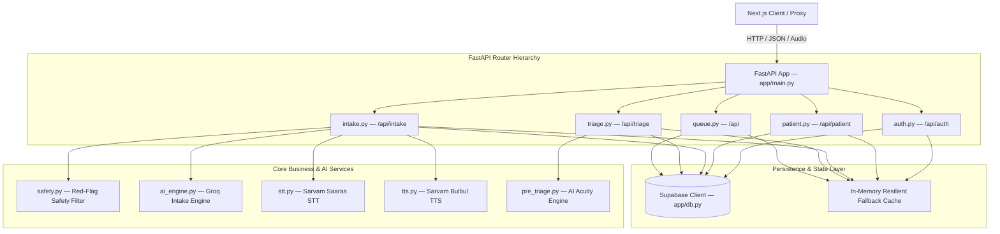

# Backend Architecture & Service Layer

The MediKiosk backend is built with **FastAPI** (Python 3.10+) running asynchronously via **Uvicorn**. It handles authentication, patient profile management, AI survey dialogue loops, deterministic red-flag screening, AI pre-triage acuity calculation, Super Admin review gates, doctor queue scheduling, and digital prescription issuance.

---

## 🏗️ Backend System Architecture

---

## 🧩 Core Architectural Principles

### 1. Unified Pydantic Models (`app/models.py`)
To prevent model-per-file sprawl and circular imports, all request/response schemas, database mirror entities, and service domain objects are declared in `app/models.py`.
- **Auth:** `RegisterRequest`, `LoginRequest`
- **Patient:** `PatientProfileUpdate`, `ConsentRequest`
- **Intake:** `StartSessionRequest`, `IntakeMessageRequest`, `IntakeResponse`, `ConversationState`, `PatientCase`
- **Safety:** `RedFlagResult`
- **Speech:** `STTResponse`
- **Triage:** `EvidenceItem`, `UncertaintyInfo`, `PreTriageAssessment`, `TriageApprovalRequest`
- **Queue & Consultation:** `QueueItem`, `PrescriptionItem`, `ConsultationRequest`, `ConsultationRecord`

### 2. Dual-Layer Storage & Resilient Fallbacks
All routers are architected with automatic in-memory fallback mechanisms (`_MEM_SESSIONS`, `_MEM_MESSAGES`, `_MEM_CASES`, `_TRIAGE_ASSESSMENTS`, `_DOCTOR_QUEUE`, `_DEV_PROFILES`).
- If Supabase PostgreSQL is connected, data is persisted with Row Level Security.
- If running in offline test environments or during database outages, operations fail gracefully to local thread-safe caches, ensuring 100% demo and test uptime.

### 3. Stateless AI Orchestration
Neither the Groq LLM nor the Sarvam speech APIs hold persistent conversational state.
- For each conversational turn, the backend retrieves conversation history from Supabase or `_MEM_MESSAGES`.
- `build_messages()` constructs the system context, previous turns, and the latest user statement.
- The LLM returns structured JSON containing answered fields, missing fields, category, and extracted facts.
- The backend mutates the session's `ConversationState` and persists it.

---

## 🛠️ Router Modules & Implementation Details

### `app/routers/auth.py`
- **Endpoints:**
  - `POST /api/auth/register`: Signs up user via `supabase.auth.sign_up()`, creates patient record in `patients` table.
  - `POST /api/auth/login`: Signs in user via `supabase.auth.sign_in_with_password()`, returns JWT `access_token` and `refresh_token`.
  - `GET /api/auth/me`: Verifies Bearer token with Supabase GoTrue and returns authenticated user details.
- **Helper `get_user_id(authorization: str) -> str`:**
  - Extracts and verifies token.
  - Supports mock/dev tokens (`mock-admin-token`, `mock-doctor-token`, `patient-101`, `dev_test_token_medikiosk`).

### `app/routers/patient.py`
- **Endpoints:**
  - `GET /api/patient/profile`: Returns patient demographics.
  - `POST /api/patient/profile`: Updates demographics (`full_name`, `age`, `gender`, `blood_group`, `phone`, `emergency_contact`).
  - `POST /api/patient/consent`: Updates `consent_given` and writes an immutable audit record to `audit_logs`.
  - `GET /api/patient/sessions`: Lists all previous intake sessions for the authenticated patient.
  - `POST /api/patient/documents/upload`: Streams uploaded medical file to Supabase Storage bucket `medical-documents` under `{patient_id}/{filename}` and records metadata in `medical_documents` table.
  - `GET /api/patient/documents`: Lists uploaded files.

### `app/routers/intake.py`
- **Endpoints:**
  - `POST /api/intake/session`: Starts new intake session, sets initial stage to `greeting`, logs localized greeting in conversation history.
  - `POST /api/intake/message`: Text message turn processing:
    1. Deterministic safety check on raw text (`safety.check_red_flags()`).
    2. Context construction from history.
    3. LLM call via `ai_engine.process_message()`.
    4. Post-LLM safety check on extracted facts (`safety.check_extracted_facts()`).
    5. Updates `ConversationState` in database.
    6. If `survey_complete` is true, auto-triggers `_generate_case()` and `pre_triage.run_ai_pre_triage()`.
  - `POST /api/intake/voice`: Real microphone endpoint:
    1. Validates audio bytes (>100 bytes).
    2. Transcribes via Sarvam Saaras STT (`app/services/stt.py`).
    3. Validates non-empty transcript.
    4. Processes transcript through conversation engine.
    5. Synthesizes AI response audio via Sarvam Bulbul TTS (`app/services/tts.py`) and returns base64 WAV payload.
  - `GET /api/intake/session/{session_id}`: Retrieves full session metadata, conversation transcripts, and generated `PatientCase`.
  - `POST /api/intake/session/{session_id}/complete`: Explicitly closes session and synthesizes `PatientCase`.

### `app/routers/triage.py`
- **Endpoints:**
  - `POST /api/triage/seed-demo`: Generates 10 diverse clinical test cases across P0–P3 acuity bands.
  - `POST /api/triage/assess`: Triggers AI Pre-Triage calculation for a given session.
  - `GET /api/triage/pending`: Lists all patient cases awaiting Super Admin review, sorted by urgency.
  - `POST /api/triage/{assessment_id}/review`: Super Admin review action (`approve`, `override`, `escalate`, `reject`).
    - On `approve` or `override`: Generates token number (`_TOKEN_COUNTER`), creates `QueueItem`, and pushes to `_DOCTOR_QUEUE`. Writes event to `audit_logs`.
    - On `escalate`: Activates emergency ER path.

### `app/routers/queue.py`
- **Endpoints:**
  - `GET /api/doctor/queue`: Returns active patient queue sorted by priority (`P1 Urgent -> P2 Standard -> P3 Routine`) and arrival timestamp.
  - `POST /api/doctor/turn/{session_id}/call`: Marks turn status as `called`.
  - `POST /api/doctor/turn/{session_id}/start`: Marks turn status as `in_consultation`.
  - `POST /api/doctor/turn/{session_id}/consult`: Completes consultation:
    - Marks queue item as `completed`.
    - Creates `ConsultationRecord` (Diagnosis, clinical notes, prescriptions table, follow-up advice).
    - Logs completion event in `audit_logs`.
  - `GET /api/patient/queue-status`: Returns live queue position, estimated wait time, or completed consultation prescription for the logged-in patient.

---

## ⚡ Error Handling & Resiliency Patterns

1. **HTTP Status Code Discipline:**
   - `400 Bad Request`: Empty input, invalid payload, or attempt to mutate a completed session.
   - `401 Unauthorized`: Missing or invalid Bearer token.
   - `404 Not Found`: Non-existent session, assessment, or queue item.
   - `422 Unprocessable Entity`: Silent or empty audio recordings.
   - `502 Bad Gateway`: Upstream speech recognition or AI engine communication failure.
2. **Structured Logging:**
   - Loggers (`medikiosk.intake`, `medikiosk.triage`, `medikiosk.queue`, `medikiosk.stt`) record diagnostic traces prefixed with `VOICE_DEBUG:` for real-time audio pipeline debugging.
