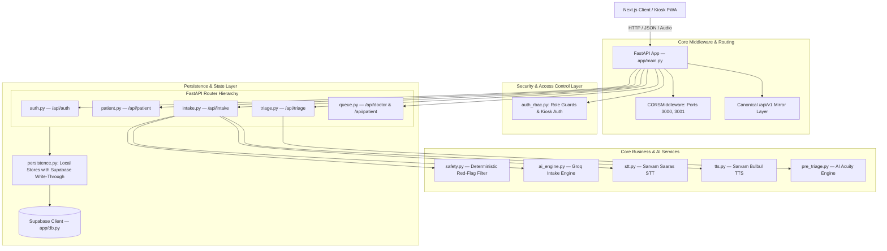

# Backend Architecture & Service Layer

The MediKiosk backend is built with **FastAPI** (Python 3.10+) running asynchronously via **Uvicorn**. It orchestrates authentication, role-based access control, conversational AI intake dialogue, deterministic red-flag screening, AI pre-triage acuity calculation, Super Admin review gates, doctor queue scheduling, and digital prescription issuance.

---

## 🏗️ Backend System Architecture

---

## 🧩 Core Architectural Principles

### 1. Unified Pydantic Models with Field Reconcilers (`app/models.py`)
All request/response schemas, database mirror entities, and service domain objects are declared in `app/models.py` with `@model_validator(mode="before")` reconcilers to ensure full backward- and forward-compatibility between frontend and backend contracts:
- **Auth & Identity:** `AuthUser`, `RegisterRequest`, `LoginRequest`.
- **Intake:** `StartSessionRequest`, `IntakeMessageRequest`, `IntakeSubmitRequest`, `IntakeSubmitResponse`, `IntakeResponse`, `ConversationState`, `PatientCase`.
- **Safety:** `RedFlagResult` (boolean red flag flag, signal IDs, alert message).
- **Triage:** `EvidenceItem`, `UncertaintyInfo`, `PreTriageAssessment` (strictly non-diagnostic), `TriageApprovalRequest`, `ReviewDecideRequest`.
- **Queue & Tokens:** `QueueItem` (bidirectionally reconciles `token_number` $\leftrightarrow$ `turn_number`, `session_id` $\leftrightarrow$ `intake_id`, `priority` $\leftrightarrow$ `priority_band`, `status` $\leftrightarrow$ `queue_status`).
- **Prescription & Consultation:** `PrescriptionItem` (bidirectionally reconciles `medication_name` $\leftrightarrow$ `medicine_name`, `duration` $\leftrightarrow$ `duration_days`), `ConsultationRequest` (reconciles `general_advice` $\leftrightarrow$ `follow_up_advice`), `ConsultationRecord`.

### 2. Centralized Role-Based Access Control (`app/auth_rbac.py`)
Provides strict authentication and authorization boundaries:
- **User Identity (`AuthUser`):** Contains `user_id`, `email`, and `role` (`admin`, `doctor`, `patient`).
- **Kiosk Walk-Up Support:** Tokens containing `kiosk` (e.g. `kiosk-terminal-101`) automatically resolve to `patient` role with unique scoped user IDs, preventing kiosk walk-up friction while blocking access to doctor/admin routes.
- **Route Guards:**
  - `require_admin(authorization)`: Enforces `admin` role (returns HTTP 403 otherwise).
  - `require_doctor(authorization)`: Enforces `doctor` or `admin` role (returns HTTP 403 otherwise).
  - `require_patient(authorization)`: Enforces authenticated session.
  - `assert_patient_access(user, patient_id)`: Enforces strict session isolation (patients cannot view or manipulate other patients' intakes).

### 3. Hybrid Persistence Layer (`app/persistence.py`)
Thread-safe in-memory stores (`_TRIAGE_STORE`, `_QUEUE_STORE`, `_CONSULTATION_STORE`, `_EMERGENCY_STORE`, `_SESSIONS_STORE`) manage active operational state with resilient write-through to Supabase PostgreSQL:
- **Safety Invariant Enforcement:** `enqueue_doctor_item()` contains a hard assertion that strictly blocks `P0` emergency cases from ever being inserted into the doctor turn queue.
- **Offline / Resilient Execution:** If Supabase credentials are missing or the database is temporarily unreachable, all store operations complete against in-memory stores with diagnostic warnings, ensuring uninterrupted development and testing.

---

## 🛠️ Router Modules & Implementation Details

### `app/routers/auth.py`
- `POST /api/auth/register`: Signs up user via `supabase.auth.sign_up()`, creates patient record in `patients` table.
- `POST /api/auth/login`: Signs in user via `supabase.auth.sign_in_with_password()`, returns JWT `access_token`, `refresh_token`, `user_id`, `email`, and `role`. Fallback mode supports mock developer credentials.
- `GET /api/auth/me`: Validates Bearer token and returns `user_id`, `email`, and `role`.

### `app/routers/patient.py`
- `GET /api/patient/profile`: Returns patient demographics.
- `POST /api/patient/profile`: Updates demographics (`full_name`, `age`, `gender`, `blood_group`, `phone`, `emergency_contact`).
- `POST /api/patient/consent`: Updates `consent_given` and writes an immutable record to `audit_logs`.
- `GET /api/patient/sessions`: Lists all previous intake sessions for the authenticated patient.
- `POST /api/patient/documents/upload`: Streams uploaded medical file to Supabase Storage bucket `medical-documents` under `{patient_id}/{filename}` and records metadata in `medical_documents` table.
- `GET /api/patient/documents`: Lists uploaded medical files.

### `app/routers/intake.py`
- `POST /api/intake/session`: Starts new conversational intake session.
- `POST /api/intake/message`: Text message turn processing:
  1. Pre-inference deterministic red-flag check (`safety.check_red_flags()`).
  2. If an emergency red flag is triggered, session status immediately transitions to `p0_escalated`, emergency timeline event is recorded in `emergency_events`, and conversational turn halts.
  3. Context construction from history and Groq LLM inference (`ai_engine.process_message()`).
  4. Post-inference safety check on extracted facts.
  5. Updates `ConversationState` in persistence.
  6. If `survey_complete` is true, generates `PatientCase` and triggers `pre_triage.run_ai_pre_triage()`.
- `POST /api/intake/voice`: Multipart audio endpoint:
  1. Validates audio bytes (>100 bytes).
  2. Transcribes via Sarvam Saaras STT (`app/services/stt.py`).
  3. Validates non-empty transcript.
  4. Processes transcript through conversation engine.
  5. Synthesizes AI response audio via Sarvam Bulbul TTS (`app/services/tts.py`) and returns base64 WAV payload.
- `POST /api/intake/submit`: Batch intake submission for fast-track/frozen contracts.
- `GET /api/intake/session/{session_id}`: Retrieves full session metadata, conversation transcripts, and generated `PatientCase`.
- `POST /api/intake/session/{session_id}/complete`: Explicitly closes session and synthesizes `PatientCase`.

### `app/routers/triage.py`
- `POST /api/triage/seed-demo`: Deterministically seeds realistic test cases covering **P0, P1, P2, and P3**:
  - P0 cases (`Rajesh Sharma` - STEMI, `Suresh Verma` - Anaphylaxis) auto-escalate directly to the `emergency_events` timeline with zero admin gating.
  - P1, P2, and P3 cases enter the doctor queue with unique tokens and assigned physicians (`Dr. Vance`, `Dr. S. Kulkarni`, `Dr. K. Iyer`).
- `GET /api/triage/pending`: Lists all patient cases awaiting Super Admin review (`awaiting_review`, `p0_escalated`, `assessment_failed`) sorted by urgency (`P0` on top). Requires `admin` role.
- `POST /api/triage/{assessment_id}/review`: Super Admin review action (`approve`, `override`, `escalate`, `reject`):
  - Strict Rule: Overriding priority requires a non-empty `override_reason` (HTTP 400 otherwise).
  - Safety Invariant: Attempting to approve a P0 emergency into the routine doctor queue is blocked with HTTP 400.
  - On approval/override of P1–P3: Generates unique token, enqueues to doctor queue, and logs audit record.
  - Idempotency: Repeated review requests on an already-approved assessment safely return the existing token number.

### `app/routers/queue.py`
- `GET /api/doctor/queue`: Returns active patient queue strictly sorted by priority (`P1 Urgent -> P2 Standard -> P3 Routine` FIFO) and arrival timestamp. Requires `doctor` role.
- `POST /api/doctor/turn/{session_id}/call`: Marks turn status as `called`.
- `POST /api/doctor/turn/{session_id}/in-consultation`: Marks turn status as `in_consultation`.
- `POST /api/doctor/turn/{session_id}/consult`: Doctor completes consultation and issues digital prescription:
  - Updates queue item status to `completed`.
  - Persists `ConsultationRecord` (doctor-authored diagnosis, clinical notes, reconciled prescriptions, follow-up advice).
  - Releases prescription to patient portal and logs completion in `audit_logs`.
- `GET /api/patient/queue-status`: Returns live queue position, estimated wait time, active P0 emergency alert, or completed consultation prescription. Supports optional `session_id` query parameter and optional `Authorization` header for walk-up kiosk displays.

---

## ⚡ Error Handling & Resiliency Patterns

1. **HTTP Status Code Discipline:**
   - `400 Bad Request`: Empty input, invalid payload, missing override reason on priority override, or attempting to approve P0 into normal queue.
   - `401 Unauthorized`: Missing or invalid Bearer token on protected endpoints.
   - `403 Forbidden`: Role mismatch (e.g. patient trying to access doctor queue or admin triage).
   - `404 Not Found`: Non-existent session, assessment, or turn item.
   - `422 Unprocessable Entity`: Silent or empty audio recordings.
   - `502 Bad Gateway`: Upstream speech recognition or AI engine communication failure.
2. **Structured Logging:**
   - Diagnostic loggers (`medikiosk.intake`, `medikiosk.triage`, `medikiosk.queue`, `medikiosk.persistence`, `medikiosk.rbac`) record traceable events with standard levels (`INFO`, `WARNING`, `ERROR`, `CRITICAL`).
