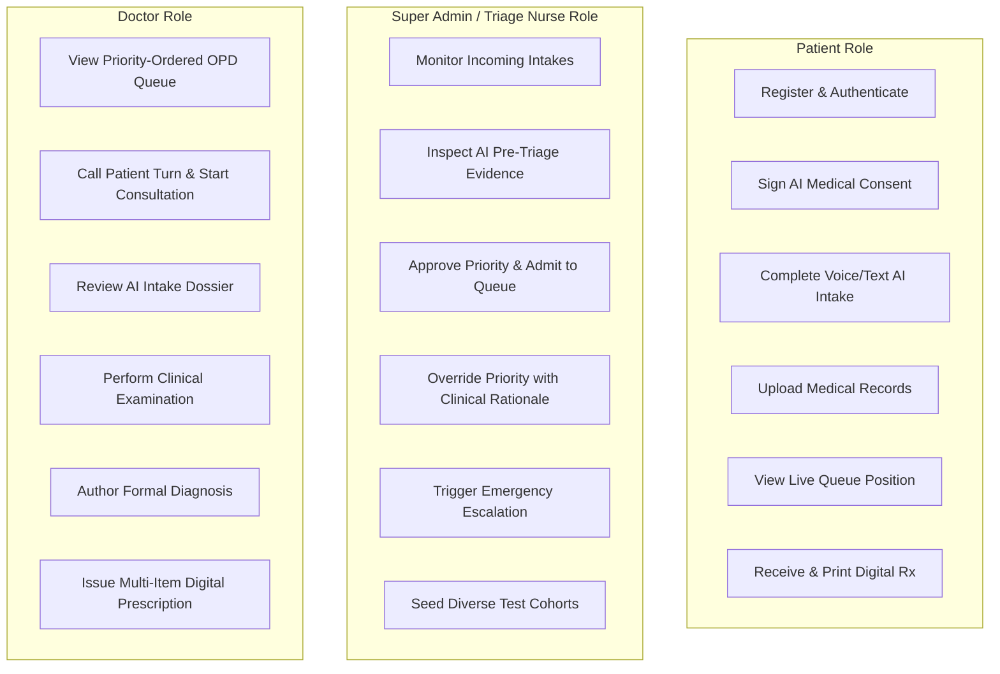

# Business Rules & Clinical Invariants

This document outlines the clinical invariants, operational boundaries, and business rules enforced by the MediKiosk application.

---

## ⚖️ Code-Enforced vs. Operational Rules Matrix

| Rule ID | Domain | Rule Description | Enforced In Code | Enforcement Location |
| :--- | :--- | :--- | :--- | :--- |
| **BR-01** | Clinical Boundary | AI must NEVER provide medical diagnoses, treatment plans, or home remedies. | **Yes** | `app/services/ai_engine.py` (Prompt & validation) |
| **BR-02** | Clinical Boundary | AI must NEVER issue prescriptions, drug dosages, or medication instructions. | **Yes** | `app/services/ai_engine.py`, `app/models.py` |
| **BR-03** | Clinical Ownership | Official diagnoses and prescriptions can ONLY be created by registered doctors during consultation. | **Yes** | `app/routers/queue.py` (`POST /doctor/turn/{id}/consult`) |
| **BR-04** | Triage Gate | AI pre-triage acuity recommendations CANNOT directly add patients to the active doctor queue without human review. | **Yes** | `app/routers/triage.py` (`_TRIAGE_ASSESSMENTS` review gate) |
| **BR-05** | Emergency Routing | Emergency red flags (P0) bypass normal queue ordering and trigger immediate emergency notifications. | **Yes** | `app/services/safety.py`, `app/routers/triage.py` |
| **BR-06** | Fact Extraction | Unstated/unknown medical information must NOT be defaulted to negative facts (e.g. unknown allergies $\neq$ "No allergies"). | **Yes** | `app/services/ai_engine.py` (Rule 3) |
| **BR-07** | Voice Discipline | Silent, corrupt, or empty audio input must be rejected without calling the LLM or injecting synthetic transcripts. | **Yes** | `app/routers/intake.py` (`POST /voice`), `app/services/stt.py` |
| **BR-08** | Consent Invariant | Patient consent is mandatory before conversational intake begins. | **Yes** | `src/app/consent/page.tsx`, `app/routers/patient.py` |
| **BR-09** | Queue Ordering | Doctor queue must strictly serve patients by priority band (`P1 -> P2 -> P3`), then arrival order. | **Yes** | `app/routers/queue.py` (`GET /doctor/queue`) |
| **BR-10** | Audit Logging | Every consent action, case generation, triage approval/override, and consultation completion must be logged immutably. | **Yes** | `audit_logs` table in `app/routers/*.py` |

---

## 🚨 Deterministic Emergency Red Flags (`app/services/safety.py`)

The deterministic safety layer scans for the following clinical trigger topics across English, Hindi, and Hinglish:

1. **Severe Breathing Emergencies:**
   - Keywords: `can't breathe`, `saans nahi`, `severe breathing`, `suffocating`, `choking`, `gasping`.
   - Action: Immediate red alert, terminates survey, sets `P0`.
2. **Acute Chest Emergencies / Possible Infarction:**
   - Keywords: `chest pain`, `seene mein dard`, `chest pressure`, `crushing chest`, `heart attack`, `dil ka daura`.
   - Action: Immediate red alert, terminates survey, sets `P0`.
3. **Acute Neurological Events / Stroke Signs:**
   - Keywords: `sudden weakness`, `sudden numbness`, `slurred speech`, `face drooping`, `stroke`, `paralysis`, `one side weak`.
   - Action: Immediate red alert, terminates survey, sets `P0`.
4. **Altered Consciousness & Critical Conditions:**
   - Keywords: `fainted`, `unconscious`, `behosh`, `passed out`, `seizure`, `severe bleeding`, `blood won't stop`.
   - Action: Immediate red alert, terminates survey, sets `P0`.
5. **Self-Harm / Mental Health Crisis:**
   - Keywords: `suicide`, `self harm`, `kill myself`, `marna chahta`.
   - Action: Immediate crisis hotline / emergency intervention alert.
6. **Severe Anaphylaxis / Airway Compromise:**
   - Keywords: `throat swelling`, `tongue swelling`, `anaphylaxis`, `can't swallow`, `lips swelling`.
   - Action: Immediate red alert, terminates survey, sets `P0`.

---

## 👥 Role Authority Matrix

