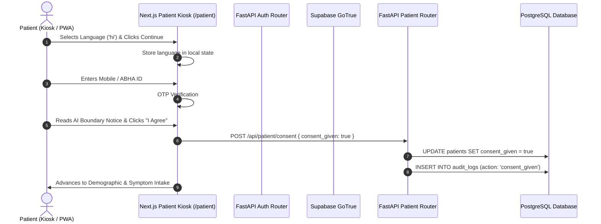
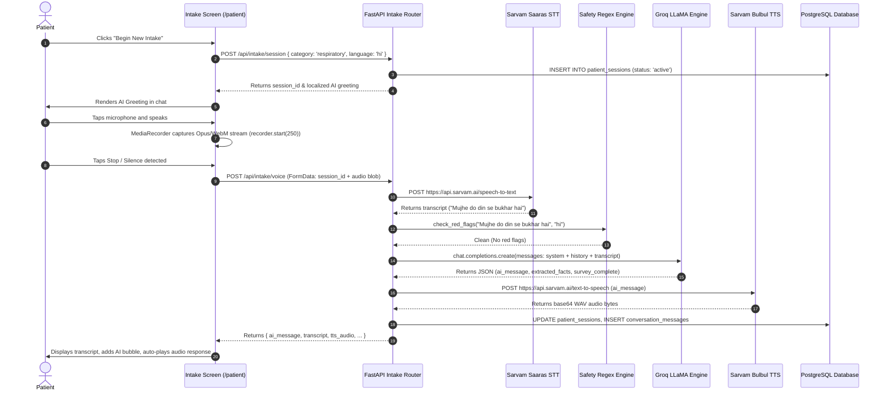
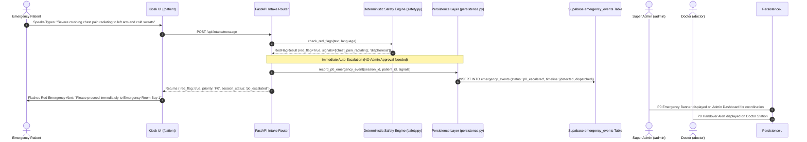
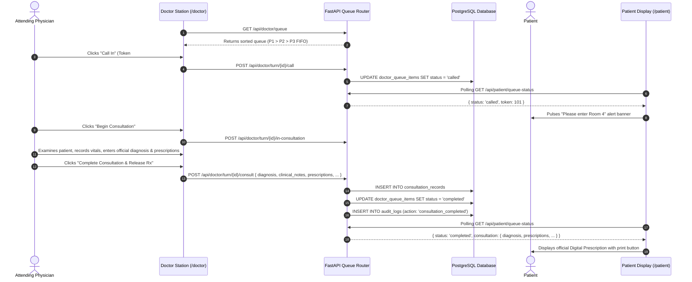

# End-to-End Clinical Data Flows

This document details the step-by-step data flows across all major user journeys in MediKiosk.

---

## 🌊 Flow 1: New Patient Intake & Demographic Onboarding



---

## 🎙️ Flow 2: Voice-Driven AI Health Assessment



---

## 🚨 Flow 3: P0 Emergency Auto-Escalation (Bypasses Admin Gate)



---

## 🛡️ Flow 4: P1–P3 Pre-Triage & Super Admin Approval Gate

```mermaid
sequenceDiagram
    autonumber
    participant IntakeAPI as FastAPI Intake Router
    participant PreTriage as AI Pre-Triage Service
    participant Groq as Groq Acuity Engine
    actor Admin as Super Admin / Triage Nurse
    participant AdminUI as Admin Station (/admin)
    participant TriageAPI as FastAPI Triage Router
    participant QueueStore as Doctor Queue Registry
    participant DB as PostgreSQL Database

    IntakeAPI->>PreTriage: run_ai_pre_triage(session_id, patient_id, PatientCase)
    PreTriage->>Groq: Evaluate case summary against P1-P3 criteria
    Groq-->>PreTriage: Returns { priority: 'P1', confidence: 0.92, uncertainty, evidence }
    PreTriage->>DB: INSERT INTO triage_assessments (status: 'awaiting_review')

    AdminUI->>TriageAPI: GET /api/triage/pending
    TriageAPI-->>AdminUI: Returns list of pending assessments
    Admin->>AdminUI: Clicks patient row -> Inspects case dossier & AI evidence quotes
    
    alt Admin Approves
        Admin->>AdminUI: Clicks "Approve Priority"
        AdminUI->>TriageAPI: POST /api/triage/{id}/review { action: 'approve' }
        TriageAPI->>QueueStore: enqueue_doctor_item()
        TriageAPI->>DB: INSERT INTO doctor_queue_items (token_number: 101, status: 'queued')
        TriageAPI->>DB: INSERT INTO audit_logs (action: 'triage_approved')
        TriageAPI-->>AdminUI: Returns { token_number: 101, status: 'queued' }
    else Admin Overrides Priority
        Admin->>AdminUI: Selects P2, enters mandatory reason: "Patient vitals stable; pain reduced"
        AdminUI->>TriageAPI: POST /api/triage/{id}/review { action: 'override', priority: 'P2', override_reason: '...' }
        TriageAPI->>QueueStore: enqueue_doctor_item(priority='P2')
        TriageAPI-->>AdminUI: Returns { token_number: 101, priority: 'P2', status: 'queued' }
    end
```

---

## 🩺 Flow 5: Doctor Consultation, Digital Rx & Record Release


