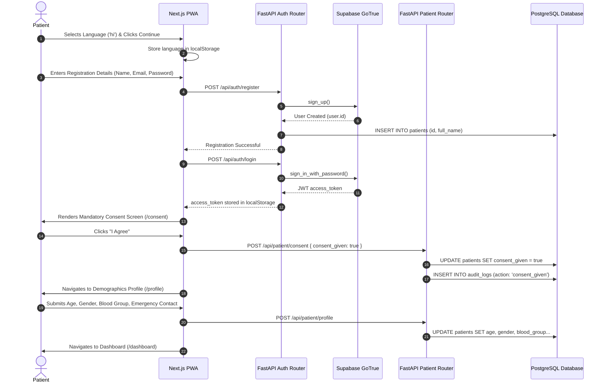
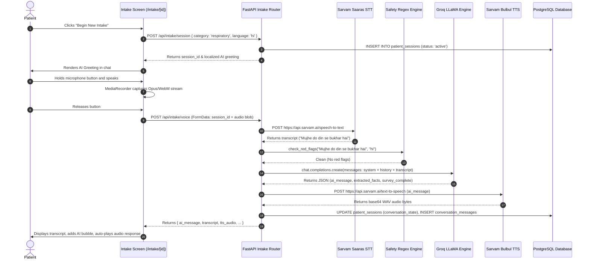
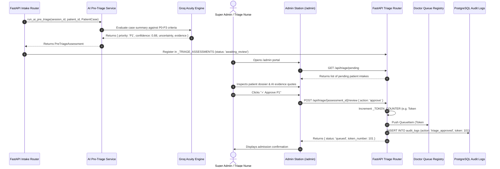
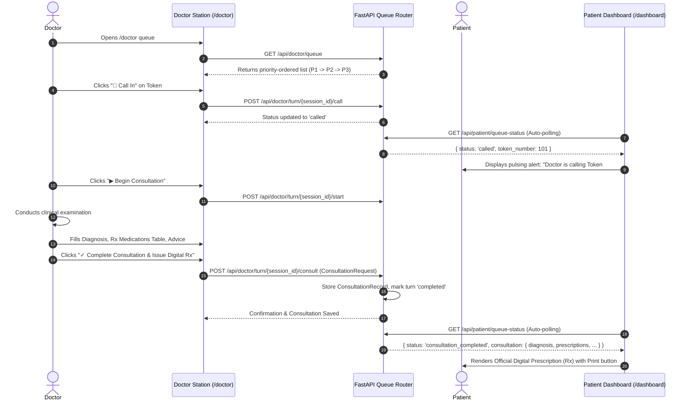
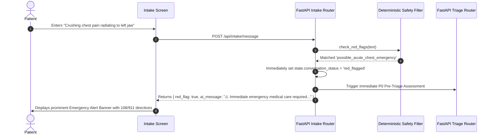

# End-to-End Clinical Data Flows

This document details the step-by-step data flows across all major user journeys in MediKiosk.

---

## 🌊 Flow 1: New Patient Intake & Demographic Onboarding

---

## 🎙️ Flow 2: Voice-Driven AI Health Assessment

---

## 🛡️ Flow 3: AI Pre-Triage & Super Admin Approval Gate

---

## 🩺 Flow 4: Doctor Consultation & Digital Prescription Release

---

## 🚨 Flow 5: Deterministic Emergency Red-Flag Escalation (P0)

