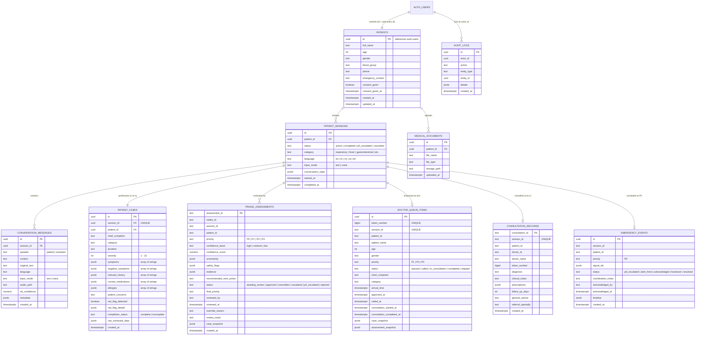

# Database Architecture & Supabase Schema

MediKiosk uses **PostgreSQL** hosted via **Supabase**. The schema enforces strict foreign key relational integrity, JSONB structured medical dossiers, Row Level Security (RLS) data isolation, and immutable audit trails across 10 tables defined in `supabase/migration.sql`.

---

## 🗄️ Entity Relationship Diagram (ERD)

---

## 📋 Table Catalog & Schema Definitions

### 1. `patients`
Demographic profile for authenticated patients.
- `id` (UUID, PK, references `auth.users.id` on delete cascade)
- `full_name` (TEXT)
- `age` (INTEGER)
- `gender` (TEXT)
- `blood_group` (TEXT)
- `phone` (TEXT)
- `emergency_contact` (TEXT)
- `consent_given` (BOOLEAN, default `FALSE`)
- `consent_given_at` (TIMESTAMPTZ)
- `created_at`, `updated_at` (TIMESTAMPTZ, default `NOW()`)

### 2. `patient_sessions`
Tracks conversational intake lifecycles.
- `id` (UUID, PK, default `gen_random_uuid()`)
- `patient_id` (UUID, FK -> `patients.id`)
- `status` (TEXT, check: `active`, `completed`, `red_flagged`, `p0_escalated`, `cancelled`)
- `category` (TEXT, e.g. `respiratory`, `fever`, `cardiovascular`)
- `language` (TEXT, check: `en`, `hi`, `mr`, `ta`, `bn`, `hinglish`)
- `input_mode` (TEXT, default `text`)
- `conversation_state` (JSONB, default `{}`)
- `started_at`, `completed_at` (TIMESTAMPTZ)

### 3. `conversation_messages`
Full conversational audit trail per turn.
- `id` (UUID, PK)
- `session_id` (UUID, FK -> `patient_sessions.id`)
- `speaker` (TEXT, check: `patient`, `assistant`)
- `content` (TEXT, cleaned text)
- `original_text` (TEXT, raw transcript)
- `language` (TEXT)
- `input_mode` (TEXT)
- `audio_path` (TEXT)
- `stt_confidence` (NUMERIC)
- `metadata` (JSONB)
- `created_at` (TIMESTAMPTZ)

### 4. `patient_cases`
Structured clinical dossier synthesized from intake dialogue.
- `id` (UUID, PK)
- `session_id` (UUID, FK -> `patient_sessions.id`, UNIQUE)
- `patient_id` (UUID, FK -> `patients.id`)
- `chief_complaint` (TEXT)
- `category` (TEXT)
- `duration` (TEXT)
- `severity` (INTEGER, check: `severity BETWEEN 1 AND 10`)
- `symptoms`, `negative_symptoms`, `relevant_history`, `current_medications`, `allergies` (JSONB)
- `patient_concerns` (TEXT)
- `red_flag_detected` (BOOLEAN, default `FALSE`)
- `red_flag_details` (JSONB)
- `completion_status` (TEXT)
- `raw_extracted_data` (JSONB)

### 5. `triage_assessments`
AI Pre-Triage recommendations and Super Admin review decisions.
- `assessment_id` (TEXT, PK)
- `intake_id` (TEXT), `session_id` (TEXT), `patient_id` (TEXT)
- `priority` (TEXT, check: `P0`, `P1`, `P2`, `P3`)
- `confidence_band` (TEXT, check: `high`, `medium`, `low`)
- `confidence_score` (NUMERIC, default 0.8)
- `uncertainty`, `safety_flags`, `evidence` (JSONB)
- `recommended_next_action` (TEXT)
- `status` (TEXT, check: `awaiting_review`, `approved`, `overridden`, `escalated`, `p0_escalated`, `rejected`, `assessment_failed`)
- `final_priority` (TEXT)
- `reviewed_by` (TEXT), `reviewed_at` (TIMESTAMPTZ)
- `override_reason` (TEXT), `review_notes` (TEXT)
- `case_snapshot` (JSONB)

### 6. `doctor_queue_items`
Active OPD doctor queue for approved patients (P1, P2, P3 only; P0 is strictly forbidden).
- `id` (UUID, PK)
- `token_number` (BIGINT, UNIQUE)
- `session_id` (TEXT, UNIQUE)
- `patient_id`, `patient_name` (TEXT)
- `age` (INTEGER), `gender` (TEXT)
- `priority` (TEXT, check: `P1`, `P2`, `P3`)
- `status` (TEXT, check: `queued`, `called`, `in_consultation`, `completed`, `skipped`)
- `chief_complaint`, `category` (TEXT)
- `arrival_time`, `approved_at`, `called_at`, `consultation_started_at`, `consultation_completed_at` (TIMESTAMPTZ)
- `case_snapshot`, `assessment_snapshot` (JSONB)

### 7. `consultation_records`
Official clinical records signed by the attending doctor.
- `consultation_id` (TEXT, PK)
- `session_id` (TEXT, UNIQUE)
- `patient_id`, `doctor_id`, `doctor_name` (TEXT)
- `token_number` (BIGINT)
- `diagnosis` (TEXT, mandatory official diagnosis)
- `clinical_notes` (TEXT, examination and observations)
- `prescriptions` (JSONB, array of prescribed medications with dosage, frequency, and instructions)
- `follow_up_days` (INTEGER)
- `general_advice`, `referral_specialty` (TEXT)

### 8. `emergency_events`
Audit and dispatch timeline for P0 emergency escalations.
- `id` (UUID, PK)
- `session_id`, `patient_id` (TEXT)
- `priority` (TEXT, default `'P0'`)
- `signal_ids` (JSONB)
- `status` (TEXT, check: `p0_escalated`, `alert_fired`, `acknowledged`, `handover`, `resolved`)
- `coordination_notes`, `acknowledged_by` (TEXT)
- `acknowledged_at` (TIMESTAMPTZ)
- `timeline` (JSONB, chronological milestone events)

### 9. `medical_documents`
Metadata for files stored in Supabase Storage.
- `id` (UUID, PK), `patient_id` (UUID, FK -> `patients.id`), `file_name`, `file_type`, `storage_path` (TEXT), `uploaded_at` (TIMESTAMPTZ).

### 10. `audit_logs`
Immutable regulatory trail for clinical actions and overrides.
- `id` (UUID, PK), `actor_id` (UUID), `action` (TEXT), `entity_type` (TEXT), `entity_id` (UUID), `details` (JSONB), `created_at` (TIMESTAMPTZ).

---

## 🔒 Row Level Security (RLS) Policies

All 10 tables have Row Level Security enabled (`ALTER TABLE ... ENABLE ROW LEVEL SECURITY`):
1. **Patients:** `patients_select_own` (`id = auth.uid()`), `patients_insert_own`, `patients_update_own`.
2. **Sessions & Cases:** Restricted to session owner (`patient_id = auth.uid()`).
3. **Messages & Documents:** Patient can read/insert their own messages and files.
4. **Consultations:** `consultations_select_own` (`patient_id = auth.uid() OR auth.jwt() ->> 'role' IN ('doctor', 'admin', 'service_role')`).
5. **Doctor Queue:** `queue_select_patient` (`patient_id = auth.uid() OR auth.jwt() ->> 'role' IN ('doctor', 'admin', 'service_role')`).
6. **Audit Logs:** Service-role only write access.

---

## ⚡ Performance Indexes

- `idx_messages_session`: `conversation_messages(session_id)`
- `idx_cases_session`: `patient_cases(session_id)`
- `idx_cases_patient`: `patient_cases(patient_id)`
- `idx_docs_patient`: `medical_documents(patient_id)`
- `idx_triage_session`: `triage_assessments(session_id)`
- `idx_triage_patient`: `triage_assessments(patient_id)`
- `idx_triage_status`: `triage_assessments(status)`
- `idx_queue_status_priority`: `doctor_queue_items(status, priority, arrival_time)`
- `idx_consultation_session`: `consultation_records(session_id)`
- `idx_consultation_patient`: `consultation_records(patient_id)`
- `idx_emergency_session`: `emergency_events(session_id)`
