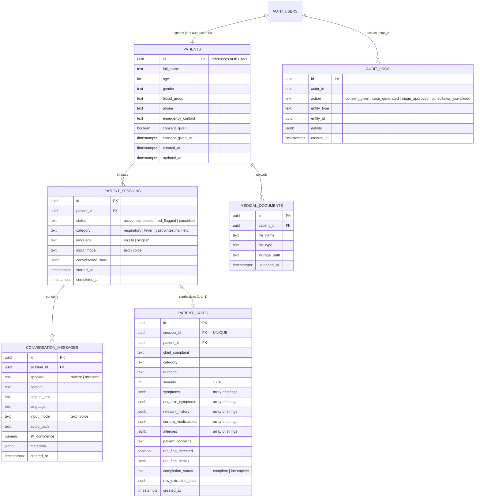

# Database Architecture & Supabase Schema

MediKiosk uses **PostgreSQL** hosted via **Supabase**. The schema enforces strict foreign key relational integrity, JSONB structured medical dossiers, Row Level Security (RLS) data isolation, and immutable audit trails.

---

## 🗄️ Entity Relationship Diagram (ERD)



---

## 📋 Table Specifications

### 1. `patients`
- **Purpose:** Stores demographic and consent status for patient accounts. Primary key maps directly to `auth.users(id)`.
- **Columns:**
  - `id` (UUID, PK, REFERENCES `auth.users(id)` ON DELETE CASCADE)
  - `full_name` (TEXT)
  - `age` (INTEGER)
  - `gender` (TEXT)
  - `blood_group` (TEXT)
  - `phone` (TEXT)
  - `emergency_contact` (TEXT)
  - `consent_given` (BOOLEAN, DEFAULT FALSE)
  - `consent_given_at` (TIMESTAMPTZ)
  - `created_at` (TIMESTAMPTZ, DEFAULT NOW())
  - `updated_at` (TIMESTAMPTZ, DEFAULT NOW())

### 2. `patient_sessions`
- **Purpose:** Represents an intake encounter / kiosk interview session.
- **Columns:**
  - `id` (UUID, PK, DEFAULT `gen_random_uuid()`)
  - `patient_id` (UUID, NOT NULL, REFERENCES `patients(id)` ON DELETE CASCADE)
  - `status` (TEXT, CHECK `status IN ('active', 'completed', 'red_flagged', 'cancelled')`)
  - `category` (TEXT)
  - `language` (TEXT, DEFAULT `'en'`)
  - `input_mode` (TEXT, DEFAULT `'text'`)
  - `conversation_state` (JSONB, DEFAULT `'{}'`)
  - `started_at` (TIMESTAMPTZ, DEFAULT NOW())
  - `completed_at` (TIMESTAMPTZ)

### 3. `conversation_messages`
- **Purpose:** Transcript log of dialogue turns between patient and AI intake assistant.
- **Columns:**
  - `id` (UUID, PK, DEFAULT `gen_random_uuid()`)
  - `session_id` (UUID, NOT NULL, REFERENCES `patient_sessions(id)` ON DELETE CASCADE)
  - `speaker` (TEXT, CHECK `speaker IN ('patient', 'assistant')`)
  - `content` (TEXT, NOT NULL)
  - `original_text` (TEXT) — Preserves raw verbatim patient statements.
  - `language` (TEXT)
  - `input_mode` (TEXT, DEFAULT `'text'`)
  - `audio_path` (TEXT) — Optional storage URI if audio is preserved.
  - `stt_confidence` (NUMERIC)
  - `metadata` (JSONB, DEFAULT `'{}'`)
  - `created_at` (TIMESTAMPTZ, DEFAULT NOW())

### 4. `patient_cases`
- **Purpose:** Structured, validated pre-consultation dossier synthesized at interview conclusion.
- **Crucial Rule:** Contains **no diagnosis** field by design.
- **Columns:**
  - `id` (UUID, PK, DEFAULT `gen_random_uuid()`)
  - `session_id` (UUID, UNIQUE, NOT NULL, REFERENCES `patient_sessions(id)` ON DELETE CASCADE)
  - `patient_id` (UUID, NOT NULL, REFERENCES `patients(id)` ON DELETE CASCADE)
  - `chief_complaint` (TEXT)
  - `category` (TEXT)
  - `duration` (TEXT)
  - `severity` (INTEGER, 1–10)
  - `symptoms` (JSONB, DEFAULT `'[]'`)
  - `negative_symptoms` (JSONB, DEFAULT `'[]'`)
  - `relevant_history` (JSONB, DEFAULT `'[]'`)
  - `current_medications` (JSONB, DEFAULT `'[]'`)
  - `allergies` (JSONB, DEFAULT `'[]'`)
  - `patient_concerns` (TEXT)
  - `red_flag_detected` (BOOLEAN, DEFAULT FALSE)
  - `red_flag_details` (JSONB)
  - `completion_status` (TEXT, DEFAULT `'incomplete'`)
  - `raw_extracted_data` (JSONB, DEFAULT `'{}'`)
  - `created_at` (TIMESTAMPTZ, DEFAULT NOW())

### 5. `medical_documents`
- **Purpose:** Tracks patient-uploaded health documents, lab tests, and imaging records.
- **Columns:**
  - `id` (UUID, PK, DEFAULT `gen_random_uuid()`)
  - `patient_id` (UUID, NOT NULL, REFERENCES `patients(id)` ON DELETE CASCADE)
  - `file_name` (TEXT)
  - `file_type` (TEXT)
  - `storage_path` (TEXT)
  - `uploaded_at` (TIMESTAMPTZ, DEFAULT NOW())

### 6. `audit_logs`
- **Purpose:** Immutable compliance record of safety decisions, consents, and status changes.
- **Columns:**
  - `id` (UUID, PK, DEFAULT `gen_random_uuid()`)
  - `actor_id` (UUID)
  - `action` (TEXT, NOT NULL)
  - `entity_type` (TEXT)
  - `entity_id` (UUID)
  - `details` (JSONB, DEFAULT `'{}'`)
  - `created_at` (TIMESTAMPTZ, DEFAULT NOW())

---

## 🛡️ Row Level Security (RLS) Policies

All tables have RLS enabled:
```sql
ALTER TABLE patients ENABLE ROW LEVEL SECURITY;
ALTER TABLE patient_sessions ENABLE ROW LEVEL SECURITY;
ALTER TABLE conversation_messages ENABLE ROW LEVEL SECURITY;
ALTER TABLE patient_cases ENABLE ROW LEVEL SECURITY;
ALTER TABLE medical_documents ENABLE ROW LEVEL SECURITY;
```

1. **`patients` Policy:** `auth.uid() = id` for `SELECT`, `UPDATE`, `INSERT`.
2. **`patient_sessions` Policy:** `patient_id = auth.uid()` for all CRUD operations.
3. **`conversation_messages` Policy:** `session_id IN (SELECT id FROM patient_sessions WHERE patient_id = auth.uid())`.
4. **`patient_cases` Policy:** `patient_id = auth.uid()`.
5. **`medical_documents` Policy:** `patient_id = auth.uid()`.
6. **`audit_logs` Policy:** Restricted to service-role key (backend only).

---

## ⚡ Performance Indexes

```sql
CREATE INDEX IF NOT EXISTS idx_sessions_patient ON patient_sessions(patient_id);
CREATE INDEX IF NOT EXISTS idx_messages_session ON conversation_messages(session_id);
CREATE INDEX IF NOT EXISTS idx_cases_session ON patient_cases(session_id);
CREATE INDEX IF NOT EXISTS idx_cases_patient ON patient_cases(patient_id);
CREATE INDEX IF NOT EXISTS idx_docs_patient ON medical_documents(patient_id);
```
