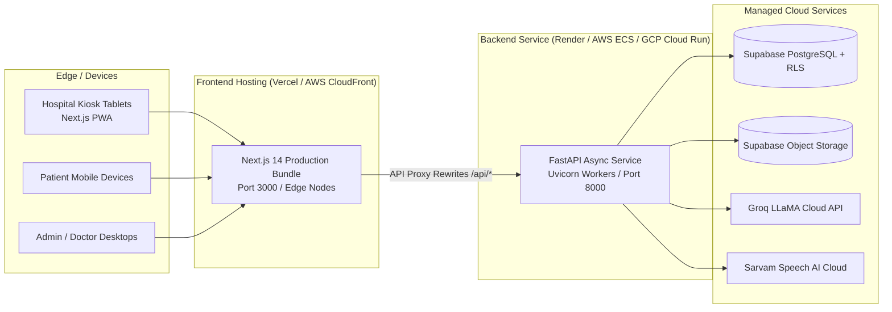

# Environment & Deployment Guide

This document specifies production deployment configurations, runtime topology, environment variables, hosting recommendations, and build commands for MediKiosk.

---

## 🌐 Production Architecture & Hosting Topology



---

## 🔑 Environment Variables Reference

### Backend (`backend/.env`)

| Variable Name | Required | Purpose | Example Value |
| :--- | :--- | :--- | :--- |
| `SUPABASE_URL` | **Yes** | HTTPS endpoint of the Supabase project. | `https://xyzproject.supabase.co` |
| `SUPABASE_SECRET_KEY`| **Yes** | Service-role secret key bypassing RLS for backend writes & audit logging. | `eyJhbGciOi...` |
| `GROQ_API_KEY` | **Yes** | API key for Groq inference service. | `gsk_...` |
| `SARVAM_API_KEY` | **Yes** | API subscription key for Sarvam Saaras STT & Bulbul TTS. | `sub_...` |
| `GROQ_MODEL` | No | Target LLM model identifier on Groq (default: `llama-3.3-70b-versatile`). | `llama-3.3-70b-versatile` |
| `SARVAM_STT_MODEL` | No | Sarvam Speech-to-Text model identifier (default: `saaras:v3`). | `saaras:v3` |
| `SARVAM_TTS_MODEL` | No | Sarvam Text-to-Speech model identifier (default: `bulbul:v3`). | `bulbul:v3` |

### Frontend (`frontend/.env.local`)

| Variable Name | Required | Purpose | Example Value |
| :--- | :--- | :--- | :--- |
| `NEXT_PUBLIC_SUPABASE_URL` | **Yes** | Public Supabase project URL for client auth. | `https://xyzproject.supabase.co` |
| `NEXT_PUBLIC_SUPABASE_PUBLISHABLE_KEY` | **Yes** | Anon/public Supabase client key. | `eyJhbGciOi...` |
| `NEXT_PUBLIC_API_URL` | **Yes** | URL of the backend FastAPI service for Next.js rewrites. | `http://localhost:8000` or `https://api.medikiosk.internal` |

---

## 🏗️ Production Build Commands

### Frontend Build (Next.js)
```bash
cd frontend
npm ci
npm run build
npm run start
```
- Output: Optimized static and server-rendered bundles in `.next/`.
- Starts production server listening on port `3000`.

### Backend Build (FastAPI / Uvicorn)
```bash
cd backend
pip install --no-cache-dir -r requirements.txt
uvicorn app.main:app --host 0.0.0.0 --port 8000 --workers 4
```

---

## 📱 Progressive Web App (PWA) Configuration

- Manifest file: `frontend/public/manifest.json`
- Key PWA Attributes:
  - `name`: `"MediKiosk — AI Patient Intake"`
  - `short_name`: `"MediKiosk"`
  - `display`: `"standalone"`
  - `theme_color`: `"#0D9488"`
  - `background_color`: `"#F8FAFC"`
  - `orientation`: `"any"`
- Security Headers configured in `next.config.js`:
  - `X-Frame-Options: DENY`
  - `X-Content-Type-Options: nosniff`
