# MediKiosk MVP — Implementation Plan

> **Authority & Source of Truth**: This implementation plan is derived directly from the project documentation (`README.md`, `docs/01-mvp-workflow.md` through `docs/13-old-to-new-for-harry.md`, `OPEN-DECISIONS.md`, and `docs/architecture/`). No unapproved clinical rules, arbitrary thresholds, or premature infrastructure have been introduced.

---

## 1. Implementation Strategy

### 1.1 Philosophy & Principles
- **Hackathon MVP Mindset (Ponytail approach)**: Minimal, clean, boring over clever, shortest working path. The goal is a working, resilient end-to-end clinical workflow demo, not speculative scalability.
- **Contract-First Development**: All boundaries (Frontend ↔ FastAPI, FastAPI ↔ AI Engine, FastAPI ↔ Supabase) are locked before parallel development begins to prevent integration bottlenecks.
- **Strict Boundary Control**: FastAPI is the **sole application authority**. The AI Engine is strictly advisory (decision support). AI cannot mutate database records, alter queues, or issue prescriptions.
- **Human-in-the-Loop Gate**: Every intake must pass Super Admin review (or P0 safety escalation) before entering the doctor-facing queue.
- **No Over-Engineering**:
  - NO microservices (Monolithic Next.js PWA + Monolithic FastAPI backend).
  - NO message brokers (Kafka/RabbitMQ/Redis Streams) — direct synchronous calls or database-backed state transitions.
  - NO CQRS or event sourcing.
  - NO Turborepo / complex monorepo orchestration — two clean independent directories (`frontend/` and `backend/`).
  - NO unnecessary state management libraries in frontend (rely on React Server Components, SWR/TanStack Query, or native `fetch`).

---

## 2. Team Workstreams & Ownership

```
┌─────────────────────────────────────────────────────────────────────────┐
│                          TEAM COORDINATION MATRIX                       │
├───────────────────┬───────────────────────────────┬─────────────────────┤
│ Team A            │ Team B                        │ Team C              │
│ Full-Stack / Core │ AI Engine (Harry)             │ QA / Validation     │
├───────────────────┼───────────────────────────────┼─────────────────────┤
│ • Next.js PWA     │ • Survey parsing & extraction │ • Test scenarios    │
│ • FastAPI Backend │ • Structured summary creation │ • Edge cases & P0   │
│ • Supabase DB/RLS │ • Advisory P0-P3 pre-triage   │ • AI fallback tests │
│ • State machine   │ • Confidence & safety flags   │ • End-to-end audit  │
│ • API contracts   │ • Engine adapter compliance   │ • Demo acceptance   │
└───────────────────┴───────────────────────────────┴─────────────────────┘
```

### Team A — Full-Stack & Integration
- **Owner**: Backend & Frontend Engineers.
- **Responsibilities**:
  - Maintain the Next.js PWA (Patient, Admin, Doctor surfaces).
  - Maintain the FastAPI API endpoints, business logic, and queue state machine.
  - Implement Supabase database schemas, storage bucket handling, and auth integrations.
  - Enforce role-based access and data security boundaries.
  - Implement the `ai_adapter.py` client calling Team B's engine.

### Team B — AI Engine (Harry)
- **Owner**: AI / ML Engineer.
- **Responsibilities**:
  - Deliver the advisory AI pre-triage engine (prompting/model pipelines).
  - Ingest sanitized intake payloads from FastAPI; return structured assessments.
  - Ensure zero queue/database mutations exist within the AI engine codebase.
  - Surface explicit uncertainty, missing information, contradictions, and safety flags.
  - Adhere to the migration contract from `docs/13-old-to-new-for-harry.md`.

### Team C — QA & Workflow Validation
- **Owner**: QA Engineer / Product Lead.
- **Responsibilities**:
  - Author and execute end-to-end integration and workflow test suites.
  - Validate safety gates: AI downtime, low-confidence routing, admin overrides, P0 immediate escalation.
  - Verify audit trails: ensure original AI assessments are preserved when overrides occur.
  - Manage demo acceptance checklist and final MVP sign-off.

---

## 3. Dependency Graph

```mermaid
flowchart TD
    subgraph Phase0["Phase 0: Contract Freeze"]
        C1["API Contracts Frozen"]
        C2["AI Schema Frozen (pretriage.v1)"]
        C3["Database Schemas Locked"]
    end

    subgraph Phase1["Phase 1: Foundation Setup"]
        F1["Frontend Scaffold & Theme"]
        B1["FastAPI Core & Health Check"]
        S1["Supabase Client & Migrations"]
    end

    subgraph Phase2["Phase 2: Patient Intake"]
        P2_UI["Patient Intake Flow (PWA)"]
        P2_API["FastAPI /intake Endpoints"]
        P2_DB["Intake Persistence & Validation"]
    end

    subgraph Phase3["Phase 3: AI Pre-Triage"]
        AI_ENG["Harry AI Engine Adapter"]
        AI_VAL["FastAPI AI Validation & Fallback"]
        AI_FLAGS["Safety Flags & Uncertainty Gate"]
    end

    subgraph Phase4["Phase 4: Queue State Machine"]
        Q_SM["Queue Lifecycle State Machine"]
        Q_P0["P0 Immediate Escalation Path"]
        Q_STG["P1-P3 Pending Approval Staging"]
    end

    subgraph Phase5["Phase 5: Super Admin Gate"]
        ADM_UI["Admin Review Dashboard"]
        ADM_ACT["Approve / Override / Reject API"]
        ADM_AUD["Immutable Audit Trail"]
    end

    subgraph Phase6["Phase 6: Doctor Workflow"]
        DOC_UI["Doctor Dashboard & Turn View"]
        DOC_ACT["Turn Advancement (Call/Start/Done)"]
    end

    subgraph Phase7["Phase 7: Records & Documents"]
        REC_API["Consultation Outcome Record"]
        REC_DOC["Medical Attachment Storage"]
    end

    subgraph Phase8["Phase 8: Patient Status"]
        PAT_UI["Patient Queue Status View"]
        PAT_HIST["Patient History (Sanitized)"]
    end

    subgraph Phase9["Phase 9: End-to-End Integration"]
        E2E_INT["Flow Integration & Notification Hooks"]
    end

    subgraph Phase10["Phase 10: Validation & Demo"]
        QA_VAL["Safety & Exception Scenarios"]
        DEMO["Demo Readiness Sign-off"]
    end

    Phase0 --> Phase1
    Phase1 --> Phase2
    Phase2 --> Phase3
    Phase3 --> Phase4
    Phase4 --> Phase5
    Phase5 --> Phase6
    Phase6 --> Phase7
    Phase5 --> Phase8
    Phase7 --> Phase9
    Phase8 --> Phase9
    Phase9 --> Phase10
```



---

## 4. Phase-by-Phase Development Plan

### Phase 0: Contract Freeze & Alignment
- **Objective**: Establish and freeze all logical schemas, request/response models, and status enums across teams before writing feature code.
- **Dependencies**: None.
- **Modules Involved**:
  - `docs/08-integration-contracts.md`
  - `backend/app/models/schemas.py`
  - `frontend/src/types/index.ts`
- **Work Breakdown**:
  - **Team A**: Translate logical models into Pydantic v2 schemas and TypeScript interfaces.
  - **Team B**: Confirm AI request/response schema (`pretriage.v1`) and error formats.
  - **Team C**: Define acceptance criteria matrix based on contracts.
- **Definition of Done (DoD)**: Schemas committed in backend and frontend; Team B signs off on `pretriage.v1` payload.

---

### Phase 1: Foundation & Scaffold Setup
- **Objective**: Establish running Next.js PWA, FastAPI service, and Supabase client connectivity.
- **Dependencies**: Phase 0.
- **Modules Involved**:
  - `frontend/src/app/`, `frontend/next.config.js`, `frontend/package.json`
  - `backend/app/main.py`, `backend/app/config.py`, `backend/requirements.txt`
  - `backend/app/deps.py`
- **Work Breakdown**:
  - **Frontend**: Clean layout, global SCSS setup, route groups `(patient)`, `(doctor)`, `(admin)`, `(auth)`.
  - **Backend**: FastAPI app initialization, CORS middleware, Pydantic settings loading `.env`, `/health` endpoint.
  - **Database**: Supabase project initialization, environment variables configured, connection test.
- **Definition of Done (DoD)**: `npm run build` passes; `uvicorn app.main:app` runs; `/health` returns `200 OK`; Supabase ping succeeds.

---

### Phase 2: Patient Intake & Storage
- **Objective**: Allow patients to complete medical onboarding survey and persist raw intake records.
- **Dependencies**: Phase 1.
- **Modules Involved**:
  - `frontend/src/app/(patient)/intake/`
  - `backend/app/routers/intake.py`
  - `backend/app/models/schemas.py`
  - Supabase `intakes` table
- **Work Breakdown**:
  - **Frontend**: Multi-step survey UI (symptoms, duration, emergency checks, basic details); validation before submission; offline-aware draft state.
  - **Backend**: `POST /api/v1/intake` endpoint; schema validation; generate `intake_id`; set status to `intake_submitted`.
  - **Database**: Insert row in `intakes` table with JSONB structured answers.
  - **Testing**: Test valid submission, partial submission validation error, payload sanitization.
- **Definition of Done (DoD)**: Patient submits survey on PWA; backend validates and returns `intake_id`; row persisted in Supabase.

---

### Phase 3: AI Engine Integration & Safety Layer
- **Objective**: Send intake payload to Harry's AI Engine, receive advisory assessment, validate schema, and detect safety flags.
- **Dependencies**: Phase 2.
- **Modules Involved**:
  - `backend/app/services/ai_adapter.py`
  - `backend/app/routers/intake.py`
  - Harry's AI Engine service
  - Supabase `ai_assessments` table
- **Work Breakdown**:
  - **AI Engine (Team B)**: Run pre-triage inference; return P0-P3 recommendation or explicit `needs_human_review`, confidence score/band, safety flags, and evidence array.
  - **Backend (Team A)**: Implement `ai_adapter.py` with HTTP client, timeout, and retry limits; validate received response against `pretriage.v1` Pydantic model; store raw AI output in `ai_assessments`.
  - **Safety Gate**: If AI call fails, times out, or returns malformed data, transition intake to `assessment_failed` / `needs_human_review` (never default to P3).
- **Definition of Done (DoD)**: Submitting an intake triggers AI assessment; valid payload is stored in `ai_assessments` linked to `intake_id`; AI timeout gracefully degrades to manual review state without crashing.

---

### Phase 4: Queue State Machine & Priority Routing
- **Objective**: Implement backend lifecycle state machine, segregating P0 emergencies from P1-P3 review queues.
- **Dependencies**: Phase 3.
- **Modules Involved**:
  - `backend/app/services/queue_engine.py`
  - `backend/app/routers/queue.py`
  - Supabase `queue_entries` table
- **Work Breakdown**:
  - **Backend**: Implement state transition logic:
    `intake_submitted -> assessment_ready -> awaiting_review -> approved -> queued -> called -> in_consultation -> completed`.
  - **P0 Escalation Logic**: If AI response contains priority `P0` or critical safety flags, mark status as `p0_escalated` and flag for immediate operational intervention (bypass normal queue).
  - **P1-P3 Logic**: Place intake into `awaiting_review` state.
- **Definition of Done (DoD)**: Intakes with P0 are routed to immediate escalation status; P1-P3 intakes land in `awaiting_review`; unauthorized queue changes rejected.

---

### Phase 5: Super Admin Review & Approval Gate
- **Objective**: Provide Super Admin interface to inspect AI advisory output, approve/modify priority, and admit patients to the doctor queue.
- **Dependencies**: Phase 4.
- **Modules Involved**:
  - `frontend/src/app/(admin)/review/`
  - `backend/app/routers/review.py`
  - Supabase `review_decisions` and `queue_entries` tables
- **Work Breakdown**:
  - **Frontend (Admin)**: Review dashboard displaying pending intakes, patient answers, AI advisory priority, confidence band, uncertainty reasons, and evidence citations.
  - **Backend**:
    - `GET /api/v1/review/pending`: List pending assessments.
    - `POST /api/v1/review/{intake_id}/decide`: Actions: `APPROVE`, `OVERRIDE`, `REJECT`, `REQUEST_CLARIFICATION`.
  - **Audit Logging**: Write decision to `review_decisions` recording reviewer ID, timestamp, original AI priority, final assigned priority, and reason for change. Original AI record remains immutable.
  - **Queue Admission**: On `APPROVE` or `OVERRIDE`, generate active entry in `queue_entries`.
- **Definition of Done (DoD)**: Admin can review an intake, override a priority with mandatory justification, and admit it; queue entry is created; full audit record is verified.

---

### Phase 6: Doctor Dashboard & Turn-Wise Queue
- **Objective**: Display approved patients in priority-ordered turns and manage consultation lifecycle.
- **Dependencies**: Phase 5.
- **Modules Involved**:
  - `frontend/src/app/(doctor)/dashboard/`
  - `backend/app/routers/consultation.py`
  - Supabase `queue_entries` table
- **Work Breakdown**:
  - **Backend**:
    - `GET /api/v1/doctor/queue`: Return approved queue sorted by priority (`P1 > P2 > P3`) and arrival/approval timestamp.
    - `POST /api/v1/doctor/turn/{queue_id}/call`: Transition `queued -> called`.
    - `POST /api/v1/doctor/turn/{queue_id}/start`: Transition `called -> in_consultation`.
  - **Frontend (Doctor)**: View active queue list; visible AI disclaimer tag ("AI Pre-Triage advisory"); click to call patient; trigger consultation view.
- **Definition of Done (DoD)**: Doctor views prioritized queue; cannot see unapproved intakes; advances patient turn status from `queued` to `in_consultation`.

---

### Phase 7: Consultation Outcome & Medical Records
- **Objective**: Enable doctors to record consultation summaries, upload attachments, and finalize patient visits.
- **Dependencies**: Phase 6.
- **Modules Involved**:
  - `frontend/src/app/(doctor)/consultation/[id]/`
  - `backend/app/routers/consultation.py`
  - Supabase `consultations`, `patient_records`, and Supabase Storage bucket (`medical-documents`)
- **Work Breakdown**:
  - **Frontend**: Doctor note-taking form, clinical outcome selector, file attachment upload component.
  - **Backend**:
    - `POST /api/v1/consultation/{consultation_id}/complete`: Record notes, doctor identity, timestamp.
    - Transition queue status to `completed`.
    - Upload documents to Supabase Storage; save signed URL/reference in `patient_records`.
- **Definition of Done (DoD)**: Doctor completes visit; record is permanently saved; visit disappears from active doctor queue and appears in completed records.

---

### Phase 8: Patient Dashboard & Status Visibility
- **Objective**: Provide patients with real-time visibility into their queue status and permitted historical records.
- **Dependencies**: Phases 5 & 7.
- **Modules Involved**:
  - `frontend/src/app/(patient)/dashboard/`
  - `backend/app/routers/intake.py`
- **Work Breakdown**:
  - **Frontend**: Clean patient status card showing: current state ("In Review", "Waiting in Queue", "Called", "Completed"), estimated turn indicator (without clinical SLA promise), and past completed consultation summaries.
  - **Backend**: `GET /api/v1/patient/status`: Sanitized response excluding internal AI confidence scores, model internals, and admin review notes.
- **Definition of Done (DoD)**: Patient sees accurate queue status updates; internal administrative metadata is strictly scrubbed from patient response.

---

### Phase 9: End-to-End Integration & Event Notifications
- **Objective**: Wire all services end-to-end, test state transitions across roles, and integrate status alert hooks.
- **Dependencies**: Phases 1 through 8.
- **Work Breakdown**:
  - Connect Patient PWA, Super Admin UI, and Doctor UI against a single running backend.
  - Integrate status notification triggers (polling or webhook hooks where defined).
  - Validate role isolation: ensure Patient cannot hit Admin or Doctor endpoints.
- **Definition of Done (DoD)**: A single visit flows seamlessly from Patient Intake → AI Pre-Triage → Admin Approval → Doctor Consultation → Record Completion → Patient Status Update.

---

### Phase 10: Testing, Hardening & MVP Demo Readiness
- **Objective**: Validate all safety gates, edge cases, failure recoveries, and prepare deterministic demo walkthrough.
- **Dependencies**: Phase 9.
- **Work Breakdown**:
  - **Team C Execution**: Run full test matrix (Happy path, P0 emergency path, AI service outage, admin rejection/override, invalid survey inputs).
  - Ensure zero console crashes, broken styles, or unhandled 500 errors.
  - Finalize demo script and sample patient personas.
- **Definition of Done (DoD)**: All items in Demo Readiness Checklist pass; team sign-off achieved.

---

## 5. API Contract Plan

All contracts operate under prefix `/api/v1`.

### 5.1 Patient ↔ FastAPI
| Endpoint | Method | Purpose | Role | Status |
|---|---|---|---|---|
| `/intake` | `POST` | Submit structured survey answers & initiate visit | Patient | Confirmed |
| `/patient/status/{intake_id}` | `GET` | Retrieve sanitized patient queue position & status | Patient | Confirmed |
| `/patient/history` | `GET` | View past consultation summaries | Patient | Confirmed |

#### Sample: `POST /api/v1/intake`
```json
// Request
{
  "patient_ref": "pat_abc123",
  "locale": "en-US",
  "survey_answers": {
    "chief_complaint": "Persistent headache and fever for 3 days",
    "severity_scale_1_10": 7,
    "has_red_flags": false,
    "current_medications": ["Ibuprofen 200mg"],
    "allergies": ["Penicillin"]
  }
}

// Response (201 Created)
{
  "intake_id": "intk_987xyz",
  "status": "intake_submitted",
  "submitted_at": "2026-09-08T15:30:00Z"
}
```

---

### 5.2 Super Admin ↔ FastAPI
| Endpoint | Method | Purpose | Role | Status |
|---|---|---|---|---|
| `/review/pending` | `GET` | List all intakes awaiting clinical review | Super Admin | Confirmed |
| `/review/{intake_id}` | `GET` | Full review bundle (intake + AI assessment + audit) | Super Admin | Confirmed |
| `/review/{intake_id}/decide` | `POST` | Approve, override, or reject intake priority | Super Admin | Confirmed |

#### Sample: `POST /api/v1/review/{intake_id}/decide`
```json
// Request
{
  "decision": "OVERRIDE", // APPROVE | OVERRIDE | REJECT | REQUEST_CLARIFICATION
  "final_priority": "P1", // P0 | P1 | P2 | P3
  "reason": "Patient notes severe stiff neck accompanying fever; escalates urgency.",
  "reviewer_id": "adm_456def"
}

// Response (200 OK)
{
  "decision_id": "dec_333aaa",
  "intake_id": "intk_987xyz",
  "status": "approved",
  "queue_id": "q_777bbb",
  "assigned_priority": "P1",
  "decided_at": "2026-09-08T15:35:00Z"
}
```

---

### 5.3 Doctor ↔ FastAPI
| Endpoint | Method | Purpose | Role | Status |
|---|---|---|---|---|
| `/doctor/queue` | `GET` | List active approved patient turns in order | Doctor | Confirmed |
| `/doctor/turn/{queue_id}/call` | `POST` | Call next patient into consultation room | Doctor | Confirmed |
| `/doctor/turn/{queue_id}/start` | `POST` | Begin active clinical consultation | Doctor | Confirmed |
| `/consultation/{consultation_id}/complete` | `POST` | Submit consultation outcome & finalize visit | Doctor | Confirmed |

#### Sample: `POST /api/v1/consultation/{consultation_id}/complete`
```json
// Request
{
  "clinical_notes": "Patient examined. Mild viral syndrome; no signs of meningitis.",
  "diagnosis_summary": "Acute viral illness",
  "treatment_plan": "Rest, oral hydration, paracetamol as needed.",
  "document_ids": ["doc_file_111"]
}

// Response (200 OK)
{
  "consultation_id": "cns_555ccc",
  "status": "completed",
  "completed_at": "2026-09-08T15:50:00Z"
}
```

---

### 5.4 FastAPI ↔ AI Engine (`pretriage.v1`)
| Direction | Purpose | Schema Version | Status |
|---|---|---|---|
| FastAPI → AI Engine | Send sanitized intake for advisory assessment | `pretriage.v1` | Confirmed |
| AI Engine → FastAPI | Structured pre-triage recommendation & uncertainty | `pretriage.v1` | Confirmed |

#### Request (`FastAPI -> AI Engine`)
```json
{
  "contract_version": "pretriage.v1",
  "request_id": "req_001",
  "intake_id": "intk_987xyz",
  "patient_reference": "pat_abc123",
  "current_intake": {
    "structured_answers": {
      "chief_complaint": "Persistent headache and fever for 3 days",
      "severity_scale_1_10": 7
    },
    "transcript": null
  },
  "allowed_context": []
}
```

#### Response (`AI Engine -> FastAPI`)
```json
{
  "assessment_id": "assm_888",
  "intake_id": "intk_987xyz",
  "priority": "P2", // P0 | P1 | P2 | P3 | null (if uncertainty forces review)
  "confidence_band": "medium", // low | medium | high
  "confidence_score": 0.74,
  "uncertainty": {
    "needs_human_review": false,
    "reasons": [],
    "missing_information": [],
    "contradictions": []
  },
  "safety_flags": [],
  "evidence": [
    {
      "source": "patient_intake",
      "field": "chief_complaint",
      "summary": "Fever and headache duration > 72 hours"
    }
  ],
  "recommended_next_action": "human_review",
  "model": {
    "name": "harry-triage-model",
    "version": "1.0.0",
    "prompt_version": "2026.09-v1"
  },
  "generated_at": "2026-09-08T15:31:00Z"
}
```

---

## 6. AI Integration Plan & Safety Boundary

### 6.1 The Safety Boundary
```
[ Patient Survey ]
       │
       ▼
[ FastAPI Backend ] ──(Saves intake)──► [ Supabase DB ]
       │
       ▼ (Sanitized payload)
[ Harry AI Engine ]
       │
       ▼ (Advisory recommendation only)
[ FastAPI Validation ] ──► Schema valid?
       │                        │
       ├─ NO / Timeout / Low Conf ──► Route to Super Admin as [Needs Human Review]
       │
       ├─ YES & P0 Flag ──────────► Immediate P0 Escalation (Bypasses queue)
       │
       └─ YES & P1-P3 ────────────► Super Admin Review Gate
                                            │
                                            ▼ (Approved / Overridden)
                                  [ Doctor Queue Entry ]
```

### 6.2 Invariants
1. **No Direct Queue Admission**: The AI engine cannot create or modify rows in `queue_entries`.
2. **No Direct Patient Communication**: The patient never directly queries or receives raw AI Engine output.
3. **Immutable History**: When an admin overrides an AI suggestion, the original `ai_assessments` row is never deleted or altered.
4. **Resilient Failure Mode**: An engine crash or timeout produces a status `assessment_failed` requiring human review; it **never** defaults to routine P3.

---

## 7. Database & Supabase Plan

### 7.1 Relational Schema
```
intakes
├── id (UUID, PK)
├── patient_ref (TEXT)
├── status (TEXT) -- intake_submitted, assessment_ready, p0_escalated, awaiting_review, approved, cancelled
├── survey_answers (JSONB)
└── created_at (TIMESTAMPTZ)

ai_assessments
├── id (UUID, PK)
├── intake_id (UUID, FK -> intakes.id)
├── priority (TEXT) -- P0, P1, P2, P3
├── confidence_band (TEXT)
├── confidence_score (NUMERIC)
├── uncertainty (JSONB)
├── safety_flags (JSONB)
├── evidence (JSONB)
├── model_metadata (JSONB)
└── created_at (TIMESTAMPTZ)

review_decisions
├── id (UUID, PK)
├── intake_id (UUID, FK -> intakes.id)
├── decision (TEXT) -- APPROVE, OVERRIDE, REJECT, REQUEST_CLARIFICATION
├── previous_priority (TEXT)
├── assigned_priority (TEXT)
├── reviewer_id (TEXT)
├── override_reason (TEXT)
└── created_at (TIMESTAMPTZ)

queue_entries
├── id (UUID, PK)
├── intake_id (UUID, FK -> intakes.id)
├── review_decision_id (UUID, FK -> review_decisions.id)
├── priority_band (TEXT) -- P1, P2, P3
├── queue_status (TEXT) -- queued, called, in_consultation, completed, skipped
├── turn_number (INTEGER)
├── doctor_id (TEXT, NULLABLE)
└── admitted_at (TIMESTAMPTZ)

consultations
├── id (UUID, PK)
├── queue_entry_id (UUID, FK -> queue_entries.id)
├── doctor_id (TEXT)
├── clinical_notes (TEXT)
├── diagnosis_summary (TEXT)
├── treatment_plan (TEXT)
└── completed_at (TIMESTAMPTZ)

patient_records
├── id (UUID, PK)
├── patient_ref (TEXT)
├── consultation_id (UUID, FK -> consultations.id)
├── record_type (TEXT) -- summary, document, prescription_note
├── storage_path (TEXT) -- Supabase Storage file key
└── created_at (TIMESTAMPTZ)
```

### 7.2 Storage Buckets
- `medical-documents`: Secure bucket for prescription scans or doctor attachments. Access restricted via signed URLs.

---

## 8. Testing Strategy (Team C)

### 8.1 Automated Test Suites
- **Unit & Schema Validation**:
  - Pydantic schema validation tests on `backend/tests/test_schemas.py`.
  - Mock AI payload parser checking adherence to `pretriage.v1`.
- **Integration Tests**:
  - FastAPI `TestClient` tests covering intake creation, state changes, and queue ordering.
  - Next.js build validation (`npm run build`).

### 8.2 Critical Manual / E2E Scenarios
1. **Happy Path (P2 Routine)**:
   - Patient submits survey → AI recommends P2 (Medium conf) → Admin approves P2 → Patient enters queue → Doctor calls patient → Doctor completes notes → Patient views summary.
2. **P0 Emergency Escalation**:
   - Patient submits chest pain / emergency signal → AI emits P0 + red flag → System flags `p0_escalated` → Immediate emergency alert in Admin UI → Bypasses standard doctor queue.
3. **AI Outage / Timeout**:
   - Simulate AI engine down → Backend handles timeout → Intake status set to `awaiting_review` with flag `ai_failed` → Admin manually assigns P1 → Queue proceeds without system crash.
4. **Admin Priority Override**:
   - AI proposes P3 → Admin overrides to P1 with reason → Queue registers entry as P1 → Audit log retains both P3 (AI) and P1 (Admin) with reason.
5. **Unauthorized Access**:
   - Verify unauthenticated user or patient role cannot access `/api/v1/review/` or `/api/v1/doctor/`.

---

## 9. MVP Definition of Done

The MediKiosk MVP is complete when:
- [ ] Patient PWA successfully captures structured intake and receives an intake ID.
- [ ] AI Engine receives sanitized payload and returns valid `pretriage.v1` advisory response.
- [ ] P0 signals trigger immediate escalation and are segregated from normal queue.
- [ ] Super Admin review dashboard displays AI advisory, confidence, and evidence, allowing Approve/Override.
- [ ] Immutable audit logs preserve AI recommendations and reviewer actions.
- [ ] Doctor dashboard displays only approved patients, ordered strictly by priority (`P1 > P2 > P3`) and timestamp.
- [ ] Doctor can advance turns (`queued` → `called` → `in_consultation` → `completed`) and record consultation outcome.
- [ ] Patient dashboard reflects live status and sanitized visit history.
- [ ] No direct AI queue/data mutations exist.
- [ ] Entire end-to-end flow runs cleanly in a local demonstration without crashes.

---

## 10. MVP vs Future Scope

| Feature Area | MUST HAVE for MVP | NICE TO HAVE (Post-MVP) | FUTURE SCOPE (Out of Scope) |
|---|---|---|---|
| **Intake** | Structured questionnaire (Next.js) | Voice recording / transcription | Multi-language real-time translation |
| **AI Triage** | Bounded advisory P0-P3 recommendation + safety flags | Contextual past record inference | Autonomous diagnosis or prescription |
| **Queue** | Priority band (P1-P3) + arrival time ordering | Dynamic wait-time estimations | Automated multi-clinic load balancing |
| **Review** | Super Admin approve / override gate | Secondary clinical review tier | Auto-approval for low-risk intakes |
| **Realtime** | SWR / polling-based UI updates | Supabase real-time subscriptions | Push notification service worker |
| **Hardware** | Web browser / tablet responsive UI | Kiosk physical peripheral integration | Swytchcode device pairing (Explicitly excluded) |

---

## 11. Open & Unresolved Decisions (From `OPEN-DECISIONS.md`)

These items remain intentionally unresolved pending clinical/operations owners:
1. **Clinical P0-P3 Definitions & SLAs**: Exact clinical diagnostic boundaries and target response times are operational policies `TBD`.
2. **P0 Emergency Escalation Channel**: Exact physical or notification destination (e.g. nurse desk phone vs hospital alert) is `TBD`.
3. **Auth Provider Model**: Supabase Auth vs mock auth headers for local MVP demo is `TBD`. (Scaffold supports pluggable auth).
4. **Fairness & Wait-Time Re-triage**: Complex time-decay priority bumping is deferred post-MVP.

---

## 12. Demo Readiness Checklist

- [ ] Backend running (`uvicorn app.main:app --port 8000`) with `/health` returning OK.
- [ ] Frontend running (`npm run dev`) with zero React hydration errors.
- [ ] Supabase connection configured and migrations applied.
- [ ] Harry's AI engine endpoint accessible (or verified adapter fallback operational).
- [ ] Demo persona 1 prepared: Routine patient (P2 path).
- [ ] Demo persona 2 prepared: Urgent patient (P1 override path).
- [ ] Demo persona 3 prepared: Emergency red-flag patient (P0 escalation path).
- [ ] Doctor consultation outcome & document attachment verified.
- [ ] Responsive UI verified on standard laptop screen and iPad/tablet viewport.
