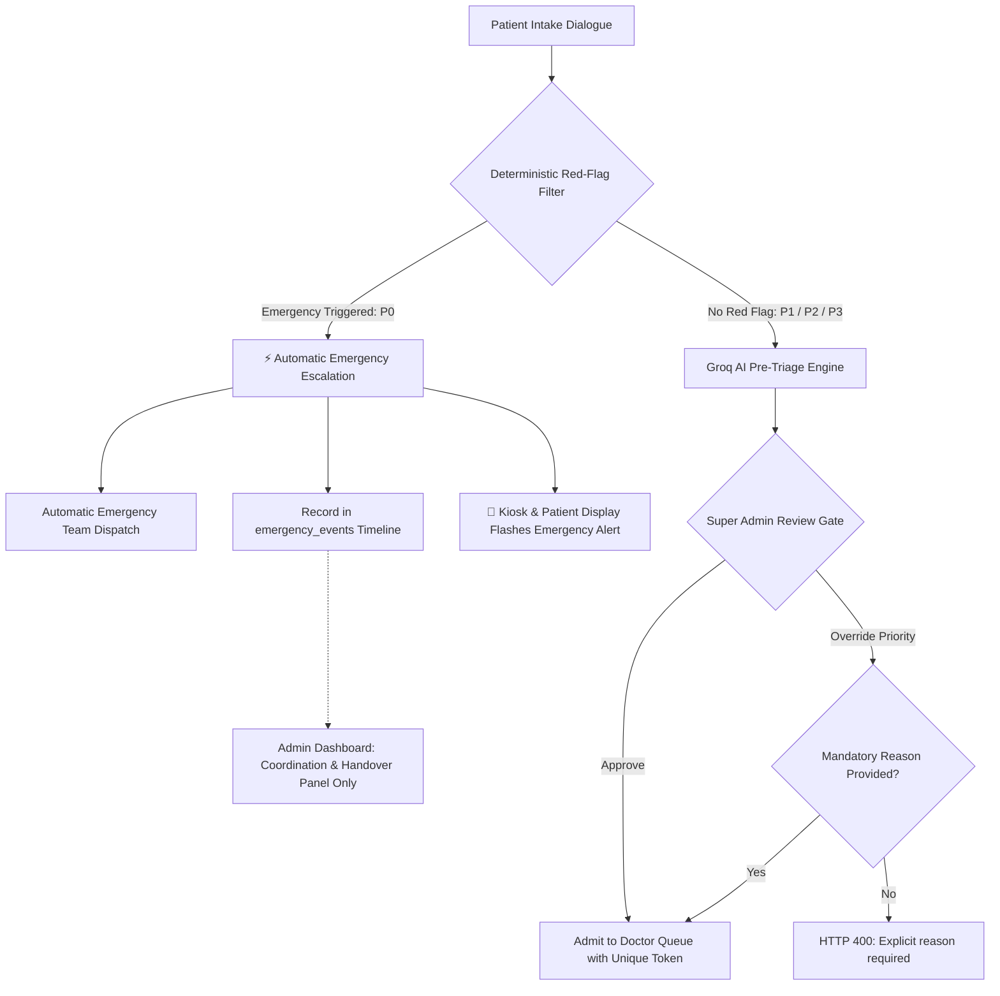
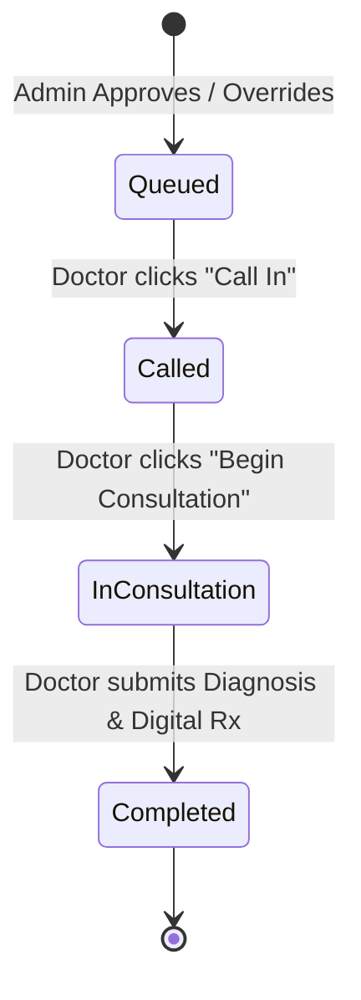

# Queue Engine & Priority Architecture

The MediKiosk Queue Engine coordinates the flow of patients from completed intake, through deterministic emergency escalation or the Super Admin triage review gate, and into the active OPD doctor turn queue.

---

## 🚦 Acuity Bands & Priority Semantics

MediKiosk defines four distinct operational priority bands:

| Priority Band | Clinical Meaning | Target Handling Window | Routing Path |
| :--- | :--- | :--- | :--- |
| **`P0` (Emergency)** | Immediate danger to life or limb (crushing chest pain with radiation/diaphoresis, acute stroke signs, severe respiratory distress, anaphylaxis, active hemorrhage, suicidal intent). | Immediate (< 1 minute) | **Bypasses normal doctor queue and admin approval.** Auto-dispatches emergency team and activates emergency timeline. |
| **`P1` (Urgent)** | High acuity acute concern (severe pain $\ge$ 8/10, acute appendicitis signs, severe asthma attack, high fever in infant/elderly). | < 15 minutes | Enters Super Admin review gate. Upon approval, placed at top of active Doctor Queue. |
| **`P2` (Standard)** | Moderate acute medical complaint (moderate fever, productive cough, acute sprain, uncomplicated UTI, sore throat). | < 45–60 minutes | Enters Super Admin review gate. Admitted into middle of Doctor Queue. |
| **`P3` (Routine)** | Low-urgency or chronic health concern (prescription refill, minor skin rash, routine blood pressure checkup). | Fast-track / routine | Enters Super Admin review gate. Admitted to routine band in Doctor Queue. |

---

## ⚡ P0 Emergency Auto-Escalation Architecture

### Absolute P0 Rules:
1. **Zero Admin Gating:** P0 emergencies are dispatched immediately upon detection. They do **NOT** require an administrator to click "Approve" or "Escalate" to trigger the emergency protocol.
2. **Normal Queue Exclusion:** P0 patients **never** enter the routine OPD doctor queue. `persistence.py` throws a hard `ValueError` if `enqueue_doctor_item()` is called with `priority="P0"`.
3. **Admin Actions:** Admin actions on P0 are strictly limited to operational coordination (`action="acknowledge"`, `action="coordinate"`, or overriding to P1/P2/P3 if clinically indicated).

---

## 🛡️ Super Admin Review Gate for P1–P3 (`app/routers/triage.py`)

No AI recommendation directly mutates the live clinical doctor queue. P1, P2, and P3 pre-triage assessments are held in `awaiting_review` status until a Super Admin or Triage Nurse reviews the dossier:

### Review Actions:
1. **`approve`:** Accepts the AI-suggested priority (`P1`, `P2`, or `P3`), assigns an incrementing token number, pushes the patient to `_QUEUE_STORE`, and writes an immutable event to `audit_logs`.
2. **`override`:** Adjusts the acuity band (e.g. elevating `P2` to `P1` or lowering `P1` to `P2`).
   - **Code Enforcement:** An explicit, non-empty `override_reason` is strictly required. If missing or whitespace, the API returns `HTTP 400 Bad Request`.
3. **`escalate` / `acknowledge`:** Handover and coordination for emergency cases.
4. **`reject`:** Cancels the intake if submitted in error, fraudulent, or duplicate.
5. **Idempotency:** If an admin submits duplicate review requests for an already-approved patient, the backend safely returns the existing token number without creating duplicate queue items.

---

## 🩺 Doctor Queue Sorting & Consultation Lifecycle (`app/routers/queue.py`)

### 1. Priority Queue Ordering Algorithm
The active queue returned by `GET /api/doctor/queue` is sorted via a strict priority tuple:
$$\text{Sort Key} = (\text{Priority Weight}, \text{Arrival Timestamp})$$
where $\text{P1} = 1$, $\text{P2} = 2$, $\text{P3} = 3$ (P0 is excluded).

This guarantees that:
- All `P1` urgent patients are attended to before any `P2` patients.
- All `P2` standard patients are attended to before any `P3` patients.
- Within the same priority band, patients are served strictly first-in, first-out (FIFO) by arrival timestamp.

### 2. Turn State Progression

- **`queued`:** Patient is in waiting lobby; patient display shows token position and estimated wait time.
- **`called`:** Doctor calls turn; patient kiosk/display pulses alert directing patient to consulting room.
- **`in_consultation`:** Consultation is actively taking place.
- **`completed`:** Consultation completed; official diagnosis and digital prescription released to patient portal.

---

## 🎫 Patient Queue Tracker & Wait Time Estimation

The patient portal (`src/app/patient/page.tsx` and `src/app/dashboard/page.tsx`) queries `GET /api/patient/queue-status`:
- **Queue Position:** Calculated as $(\text{Index in sorted active queue}) + 1$.
- **Estimated Wait Time:** Calculated as $\text{Position} \times 7\text{ minutes}$.
- **Rx Release:** When the status becomes `completed`, the tracker replaces the queue widget with the official digital prescription.
- **Kiosk Walk-Up Support:** The endpoint supports both `session_id` query parameter and optional `Authorization` header, enabling anonymous kiosk displays to poll status safely.
