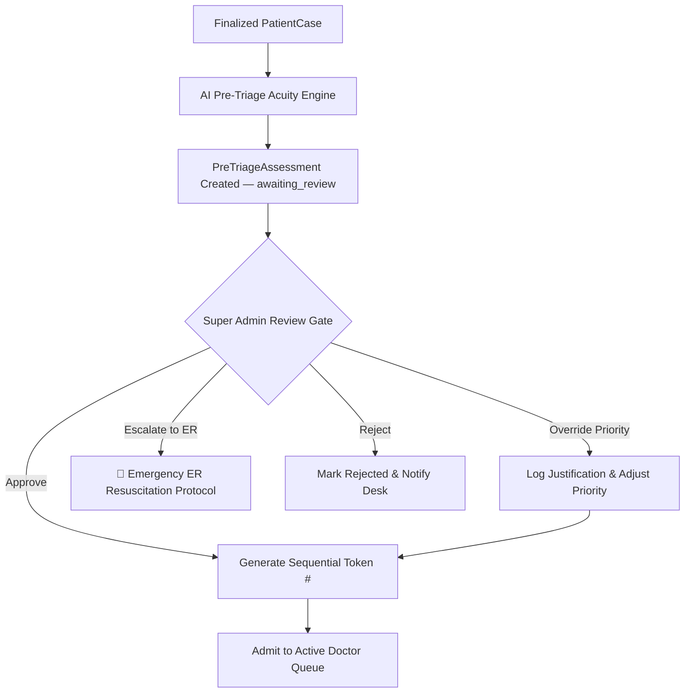
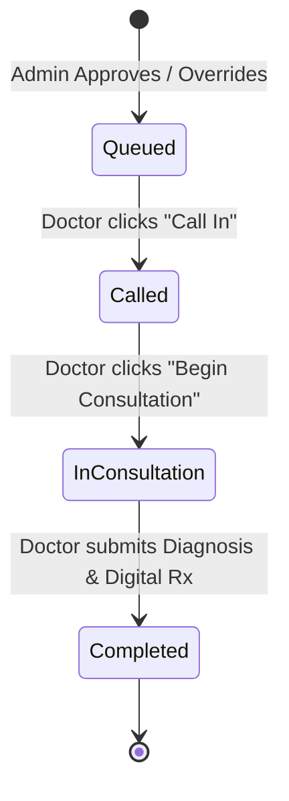

# Queue Engine & Priority Architecture

The MediKiosk Queue Engine manages the flow of patients from completed intake, through the Super Admin triage review gate, and into the active OPD doctor turn queue.

---

## 🚦 Acuity Bands & Priority Semantics

MediKiosk defines four distinct operational priority bands:

| Priority Band | Clinical Meaning | Target Handling Window | Routing Path |
| :--- | :--- | :--- | :--- |
| **`P0` (Emergency)** | Immediate danger to life or limb (severe chest pain with radiation, acute stroke signs, severe respiratory distress, anaphylaxis, active hemorrhage, suicidal intent). | Immediate (< 1 minute) | **Bypasses normal doctor queue.** Direct escalation to Emergency Resuscitation / ER. |
| **`P1` (Urgent)** | High acuity acute concern (severe pain $\ge$ 8/10, acute appendicitis signs, severe asthma attack, high fever in infant/elderly). | < 15 minutes | Top of active Doctor Queue. |
| **`P2` (Standard)** | Moderate acute medical complaint (moderate fever, productive cough, acute sprain, uncomplicated UTI, sore throat). | < 45–60 minutes | Middle of Doctor Queue. |
| **`P3` (Routine)** | Low-urgency or chronic health concern (prescription refill, minor skin rash, routine blood pressure checkup). | Fast-track / routine | Lower priority in Doctor Queue. |

---

## 🛡️ Super Admin Review Gate (`app/routers/triage.py`)

No AI recommendation directly mutates the live clinical doctor queue. All completed patient intakes are routed to the **Super Admin Review Gate**:

### Review Actions:
1. **`approve`:** Accepts the AI-suggested priority (`P1`, `P2`, or `P3`), assigns an incrementing token number (`_TOKEN_COUNTER`), pushes the patient to `_DOCTOR_QUEUE`, and writes to `audit_logs`.
2. **`override`:** The administrator selects a new priority band (e.g. elevating `P2` to `P1`) and enters a mandatory clinical justification. The overridden priority is applied to the generated token and logged in `audit_logs`.
3. **`escalate`:** Activates emergency protocol for P0 cases, notifying hospital emergency staff directly.
4. **`reject`:** Cancels the intake if submitted in error or duplicate.

---

## 🩺 Doctor Queue Sorting & Consultation Lifecycle (`app/routers/queue.py`)

### 1. Priority Queue Ordering Algorithm
The active queue returned by `GET /api/doctor/queue` is sorted via a strict priority tuple:
$$\text{Sort Key} = (\text{Priority Weight}, \text{Arrival Timestamp})$$
where $\text{P0} = 0$, $\text{P1} = 1$, $\text{P2} = 2$, $\text{P3} = 3$.

This guarantees that:
- All `P1` patients are attended to before any `P2` patients.
- Within the same priority band, patients are served first-in, first-out (FIFO) by arrival time.

### 2. Turn State Progression

- **`queued`:** Patient is in waiting lobby; patient dashboard displays position and estimated wait time.
- **`called`:** Doctor calls turn; patient dashboard pulses alert instructing patient to enter room.
- **`in_consultation`:** Consultation is actively occurring.
- **`completed`:** Consultation completed; digital prescription is signed and released to patient dashboard.

---

## 🎫 Patient Queue Tracker & Wait Time Estimation

The patient dashboard (`src/app/dashboard/page.tsx`) queries `GET /api/patient/queue-status` every 6 seconds:
- **Queue Position:** Calculated as $(\text{Index in sorted active queue}) + 1$.
- **Estimated Wait Time:** Calculated as $\text{Position} \times 7\text{ minutes}$.
- **Rx Release:** When the status becomes `consultation_completed`, the tracker replaces the queue widget with the official digital prescription.
