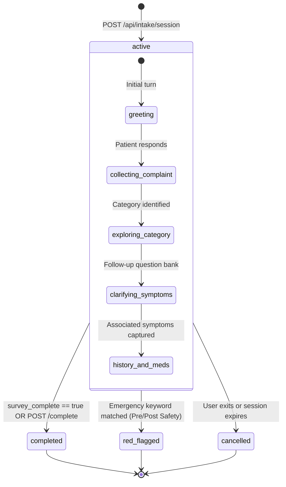
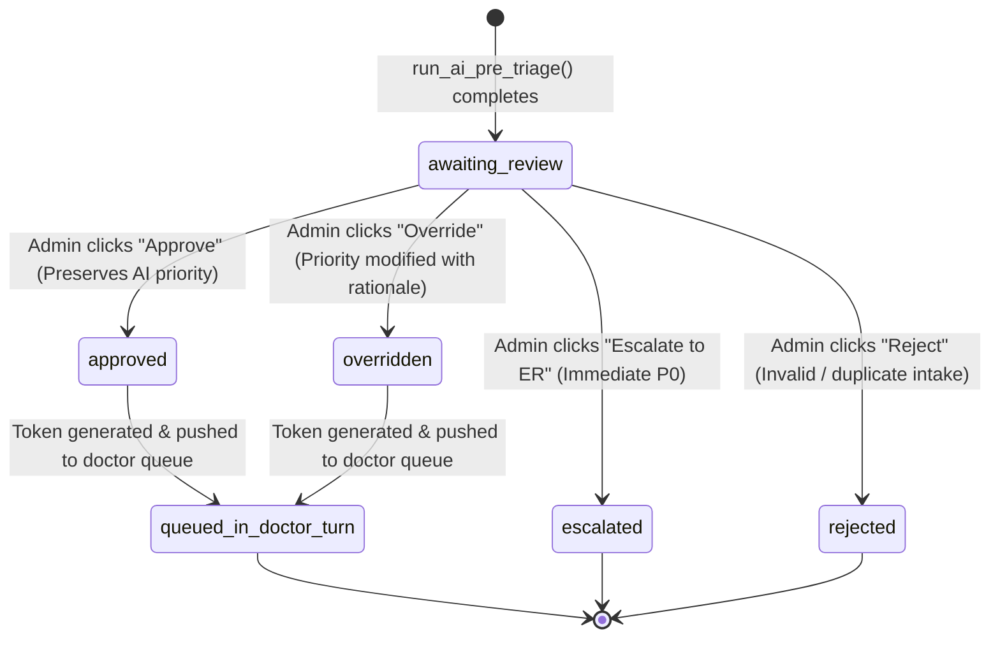
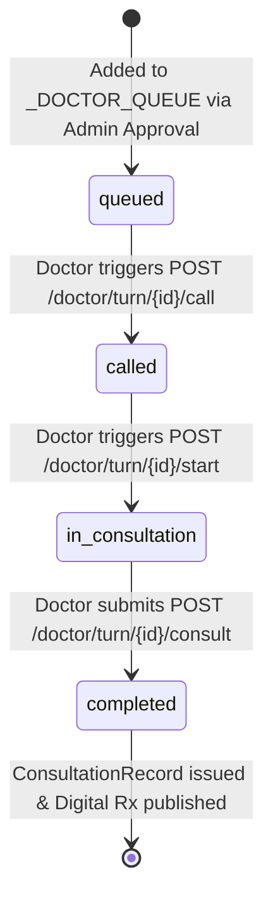
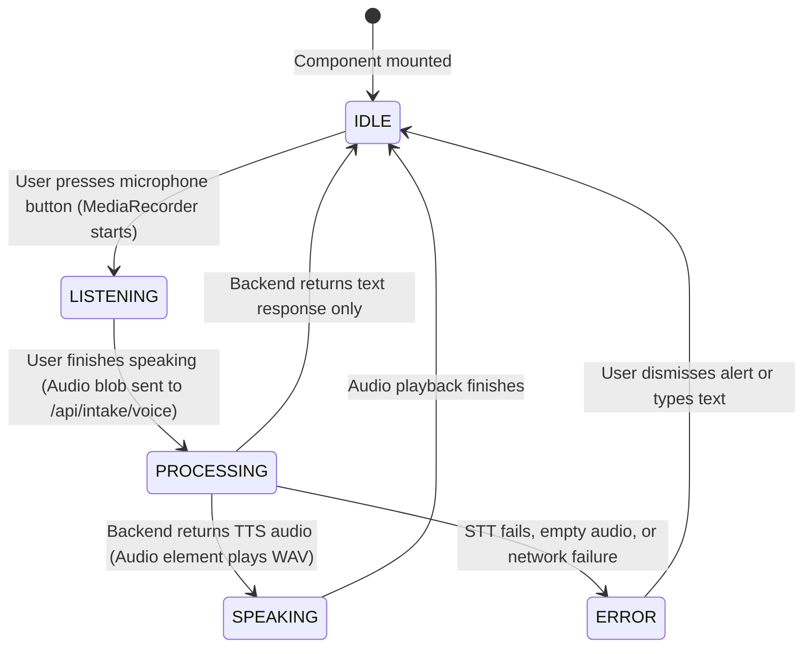

# System State Machines

This document provides formal state transition models for all core domain entities in MediKiosk.

---

## 1. Patient Intake Session Lifecycle (`patient_sessions`)



---

## 2. Pre-Triage Assessment Lifecycle (`PreTriageAssessment`)



---

## 3. Doctor Turn Queue Item Lifecycle (`QueueItem`)



---

## 4. Voice Interaction State Machine (Frontend `VoiceState`)



---

## 5. Patient Dashboard Live State Progression

```mermaid
stateDiagram-v2
    [*] --> NoActiveSession: No unconsulted session

    NoActiveSession --> IntakeActive: User clicks "Begin New Intake"
    IntakeActive --> AwaitingTriage: Survey complete; AI pre-triage generated
    AwaitingTriage --> Queued: Super Admin approves intake into doctor queue
    Queued --> Called: Doctor calls turn number (Pulse alert)
    Called --> InConsultation: Doctor starts medical consultation
    InConsultation --> ConsultationCompleted: Doctor signs Rx (Digital Rx Box rendered)
    ConsultationCompleted --> NoActiveSession: Patient reviews prescription
```
