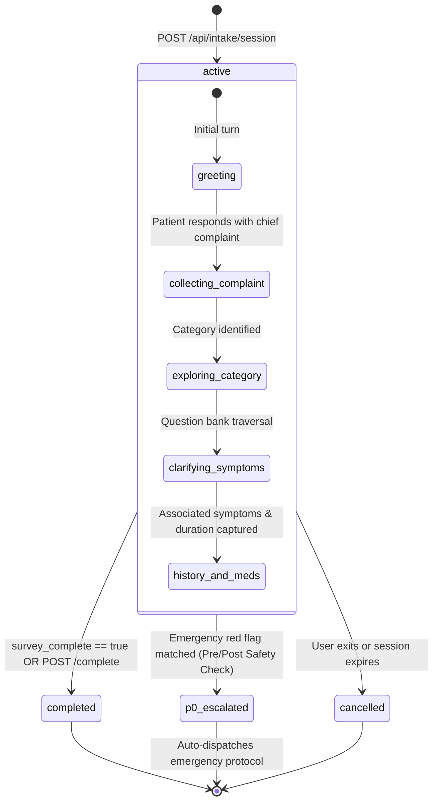
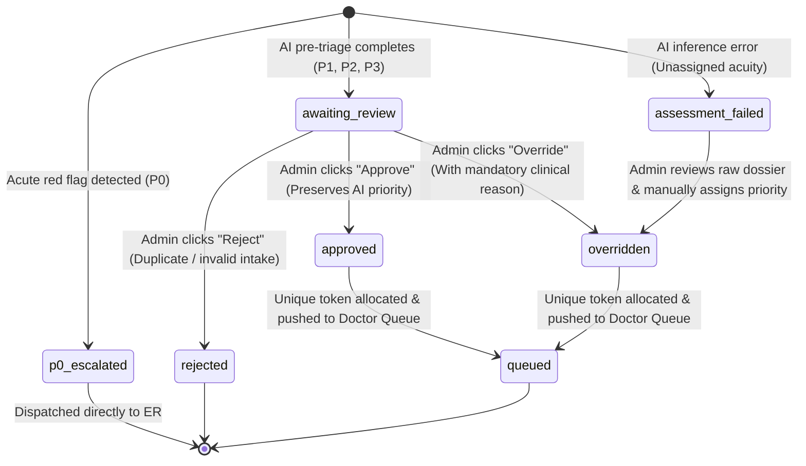
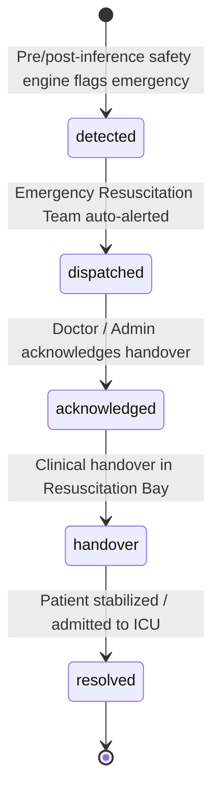
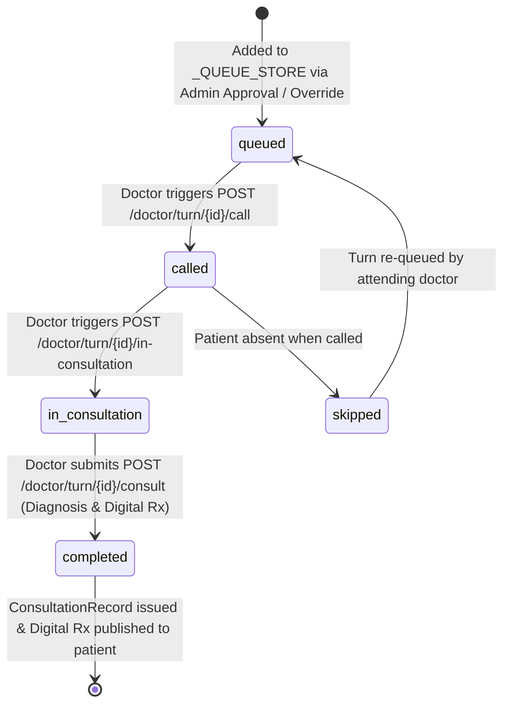
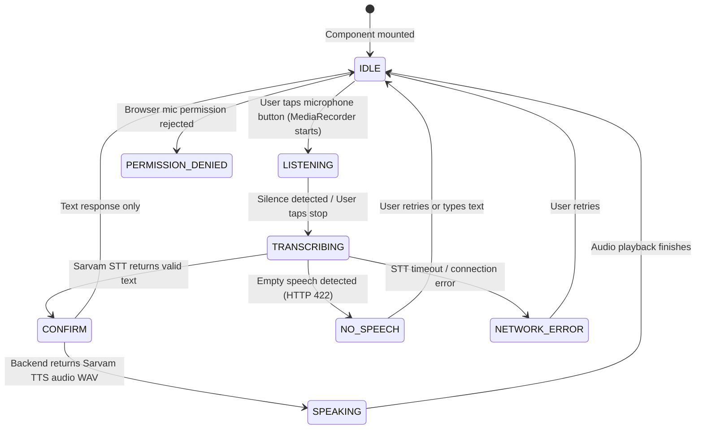

# System State Machines

This document provides formal state transition models for all core domain entities in MediKiosk.

---

## 1. Patient Intake Session Lifecycle (`patient_sessions`)

---

## 2. Pre-Triage Assessment Lifecycle (`triage_assessments`)

---

## 3. P0 Emergency Timeline Lifecycle (`emergency_events`)

---

## 4. Doctor Turn Queue Item Lifecycle (`doctor_queue_items`)

*Invariant: P0 cases are strictly forbidden from entering this state machine.*

---

## 5. Voice Interaction State Machine (Frontend `VoiceState`)

---

## 6. Patient Portal Live State Progression (`GET /api/patient/queue-status`)

```mermaid
stateDiagram-v2
    [*] --> NoActiveSession: No unconsulted intake session

    NoActiveSession --> IntakeActive: User begins self-service intake
    IntakeActive --> P0EmergencyActive: Acute emergency red-flag triggered
    IntakeActive --> AwaitingTriage: Survey complete; waiting for Admin review
    AwaitingTriage --> Queued: Super Admin approves intake into Doctor Queue
    Queued --> Called: Doctor calls turn number (Pulsing room alert)
    Called --> InConsultation: Doctor starts consultation
    InConsultation --> ConsultationCompleted: Doctor signs Digital Rx
    
    P0EmergencyActive --> [*]: Emergency room directions displayed
    ConsultationCompleted --> NoActiveSession: Patient prints/saves Digital Rx
```

