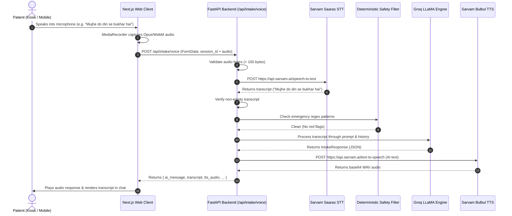

# Voice & Speech Pipeline

MediKiosk features an end-to-end voice intake pipeline engineered for clinical accuracy in Indian healthcare settings. It uses **Sarvam AI Saaras** for speech recognition (STT) and **Sarvam AI Bulbul** for speech synthesis (TTS), with strict zero-hallucination validation and anti-dummy fallbacks.

---

## 🎙️ End-to-End Voice Flow



---

## 🗣️ Speech-to-Text (STT) Implementation (`app/services/stt.py`)

- **Provider:** Sarvam AI
- **Endpoint:** `https://api.sarvam.ai/speech-to-text`
- **Model:** `saaras:v3` (configured via `SARVAM_STT_MODEL`)
- **Headers:** `api-subscription-key: <SARVAM_API_KEY>`
- **Language Mapping:**
  ```python
  _LANG_MAP = {
      "en": "en-IN",
      "hi": "hi-IN",
      "hinglish": "unknown",  # Code-mixed auto-detect
      "bn": "bn-IN",
      "kn": "kn-IN",
      "ml": "ml-IN",
      "mr": "mr-IN",
      "od": "od-IN",
      "pa": "pa-IN",
      "ta": "ta-IN",
      "te": "te-IN",
      "gu": "gu-IN",
  }
  ```
- **Diagnostic Tracing:** Logs request duration and payload size using `VOICE_DEBUG:` prefixes.

---

## 🔊 Text-to-Speech (TTS) Implementation (`app/services/tts.py`)

- **Provider:** Sarvam AI
- **Endpoint:** `https://api.sarvam.ai/text-to-speech`
- **Model:** `bulbul:v3` (configured via `SARVAM_TTS_MODEL`)
- **Language Codes:** `en-IN`, `hi-IN`
- **Audio Output:** Decodes base64 string from Sarvam JSON response into raw WAV bytes.

---

## 🛡️ Strict Defensive Voice Rules

1. **Zero Dummy Fallbacks:**
   - The voice pipeline **never** injects mock transcripts when the microphone is silent.
   - If audio bytes are empty or `< 100 bytes`, the API immediately raises HTTP `422 Unprocessable Entity` (`"Recorded audio was empty or too short"`).
2. **Empty Transcript Rejection:**
   - If Sarvam STT detects no audible speech, the API raises HTTP `422` (`"No speech detected in the audio. Please speak clearly."`).
   - Groq is **not** called with blank strings, preventing hallucinated symptoms.
3. **Graceful TTS Degradation:**
   - If Sarvam TTS fails due to rate limits or network issues, the text response is still delivered to the client, allowing the visual conversation to continue uninterrupted.
4. **Browser Audio Slicing:**
   - `src/app/intake/[sessionId]/page.tsx` starts `MediaRecorder` with `recorder.start(250)` to ensure all recorded PCM/Opus chunks are flushed before upload.
